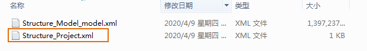
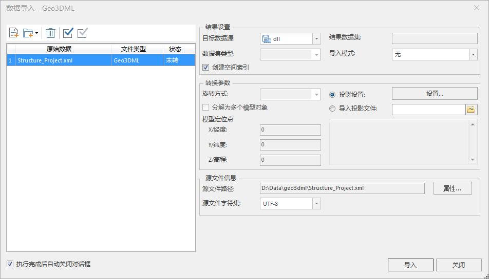

---
id: ImportGeo3DML
title: 导入Geo3DML  
---  
### 使用说明

支持导入满足《三维地质模型数据交换格式》(Geo3DML)的地质模型文件(.xml)。

### 操作步骤

  1. 在工作空间管理器中选中需导入到的 **数据源** ->单击鼠标右键-> **导入数据集** 。
  2. 单击“添加文件”按钮，在弹出的“打开”对话框中，选择Geo3DML(*.xml)类型。
  3. 在该对话框中选择到要导入的三维地质模型数据文件，单击“确定”按钮。选择导入文件时，需要选择对应的小文件，如下图所示。
  
---  
  4. 此时指定文件夹已经添加到“数据导入”对话框的列表框中，对话框右侧区域显示了导入文件需要设置的参数，如下图所示。    
   
  
---  
5. 结果设置中的数据源、结果数据集，请参见[数据导入公共参数](ParameterSettingDia.html)说明页面。默认勾选创建空间索引。
6. 转换参数:
  * **投影设置** ：用于设置导入数据集的投影，选中“投影设置”单选框，单击其右侧的“设置...”按钮，在弹出的“投影设置”对话框中设置导入后数据集的投影，投影设置的具体操作请参见“[设置投影坐标系](../Projection/PrjCoordSysDia.html)”。
  * 导入投影文件：选择“导入投影文件”单选框，单击右侧的“选择”按钮，在弹出的的“选择”窗口中，选择投影信息文件并导入即可。支持导入 shape 投影信息文件（*.shp;*.prj）、MapInfo 交换格式（*.mif）、MapInfo TAB 文件（*.tab）、影像格式投影信息文件（*.tif;*.img;*.sit）、投影信息文件（*.xml）。 
7. 参数设置完毕后，单击“导入”按钮，即可执行导入Geo3DML地质模型操作。
