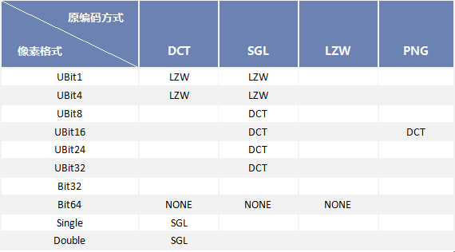

---
id: ParameterSettingDia
title: 数据导入公有参数  
---  
在 **数据导入** 对话框的数据列表中，选中不同的文件，右侧显示的参数不一致，选中多个文件时，可设置的参数也不一致。

* 若用户同时选中列表框中多个矢量数据集和栅格数据集，则参数设置区域显示的是导入数据集的公有参数。
* 不同格式的矢量数据或栅格数据，在“矢量文件参数设置”或“栅格文件参数设置”区域的参数中可设置的参数也有所差异。

### 公有参数设置

* **目标数据源：** 选择导入的文件要存放在的数据源。
* **结果数据集：** 原始数据导入后新数据集的名称。
* **导入模式：** 应用程序提供了无、强制覆盖、追加三种导入模式供用户选择。 
* **无：** 如导入的数据与已有数据集存在名称冲突，则导入的数据将自动修改名字并进行导入。
* **强制覆盖：** 如导入的数据与已有数据集存在名称冲突，则导入的数据将强制覆盖已有的同名数据集。 
* **追加：** 如导入的数据与已有数据集存在名称冲突，则导入的数据追加到已有的同名数据集，追加的条件为同名的两个数据集的类型、结构完全一致，否则不导入，在列表框中该文件的“状态”属性为“失败”。

在导入矢量和栅格数据的时候导入模式结果稍有不同。特别强调，追加模式和强制覆盖模式在存在同名数据集的情况下使用。在实际的操作过程中，请区别使用。

* 强制覆盖模式：两者都是将原有的同名数据集删除，替换为新导入的数据。
* 追加模式：对矢量数据集而言，追加是直接将要导入的数据添加到已存在的同名数据集中；对栅格或者影像数据集，追加实际上是进行两个同名数据的重合区域的更新。关于数据集的追加的详细说明，请参见[数据集追加](DataAppend.html)。

* **编码类型：** 指定是否使用压缩的方式保存数据，可以节省磁盘空间。系统默认为“未编码”，即不使用压缩。更多关于数据集编码类型的内容请参见：[数据集压缩编码方式](../DataManagement/EncodeType.html)。 
* 对于不同类型的数据集，系统会自动判断其合适的编码方式，并在下拉菜单显示。
* 对于影像和栅格数据集，在导入数据集时，系统会根据其像素格式类型判断其合理的编码方式，如果用户选择的编码方式和像素格式类型匹配不合理，系统会自动该将其修正为合理的编码方式导入当前数据源中。下表列出了影像和栅格数据集不同像素格式对应的合理的编码方式。
表：影像和栅格数据集编码方式修正  
---  
  
* **源文件信息**
* **源文件路径：** 待导入的原始数据所在的路径，可方便用户复制路径，查看原始数据。
* **源文件字符集** ：用来设置原始数据的字符集类型。应用程序支持的字符集列表，请参见[字符集列表](../DataManagement/Charset.html)。
* **属性** ：单击“属性”按钮，可查看源文件的属性信息，便于用户查看源文件的常规、安全、详细信息等属性。

### 备注

1. 若用户在列表框中同时选中了多个栅格文件或矢量文件，则“数据导入”区域的文件参数设置区域按照最后选中的数据格式显示参数设置项。
2. 若用户在列表框中同时选中了栅格数据和矢量数据，则“数据导入”区域的文件参数设置区域仅显示公共参数。
3. 如果导入单波段栅格数据，则导入模式：“无”和“追加”是同样效果，即若导入的数据与已有数据集存在名称冲突，则导入的数据将自动修改名字并进行导入。
4. 在导入 RAW 影像文件时，结果类型只能导入为 Image 数据集。不支持在 Image 数据集和 Grid 数据集之间选择。 

