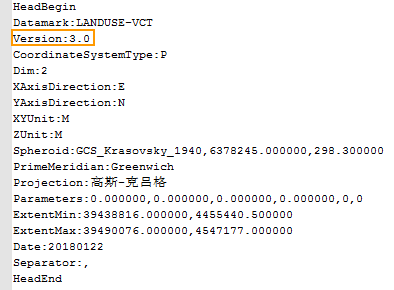
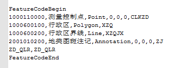
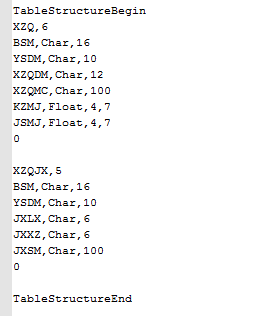
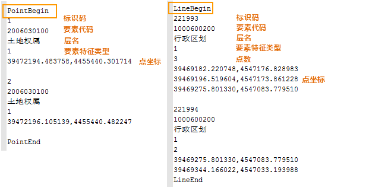
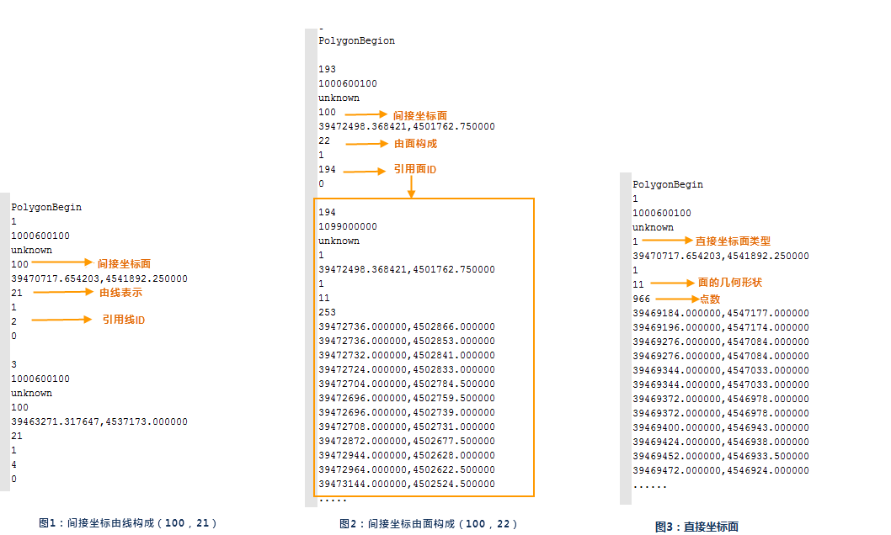
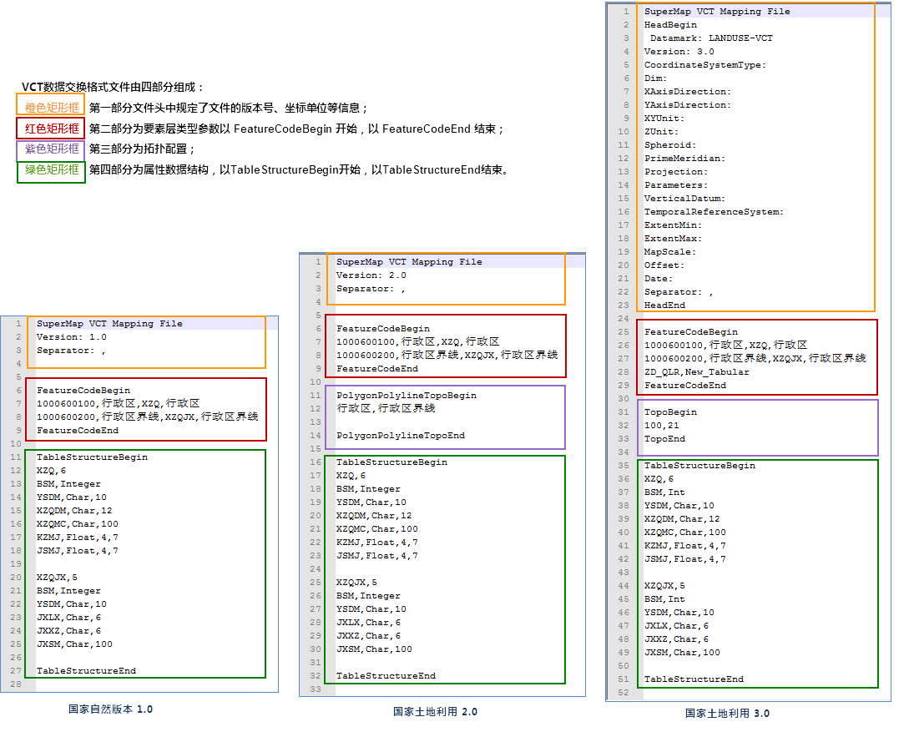

---
id: VCTConfig
title: VCT 文件  
---  
### 使用说明

国土资源部在国家标准《地理空间数据交换格式》（GB/T17798-2007）基础上制定了土地利用数据交换格式，土地利用数据仅描述矢量数据，文件的后缀名为VCT，简称为
VCT 文件，通过该文件
来实现各类国土资源空间信息的交换。VCT矢量数据交换格式广泛应用于国土资源部门土地利用现状调查成果汇交、土地利用规划成果汇交和地籍调查数据库成果交换。

VCT 文件由六部分组成：
第一部分为文件头，描述数据的基本信息，如数据范围、坐标维数、比例尺等；第二部分为要素类型参数；描述数据中包含的层要素；第三部分为属性数据结构，描述各层要素对应的属性数据结构；第四部分为图形数据，描述各层要素对象的几何图形数据；第五部分为注记，描述具有文本标注的数据；第六部分为拓扑数据，描述几何图形拓扑关系的数据；第七部分为属性数据；第八部分为图形表现数据。

**VCT 文件= 文件头 + 要素类型参数 + 属性数据结构 + 图形数据 + 注记 + 拓扑数据 + 属性数据 + 图形表现数据**

1. **第一部分为文件头** :头文件以HeadBegin开始，以HeadEnd结束，其中 Version: 表示 VCT 文件的版本号,用1.0、2.0、3.0表示。    
---  
2. **第二部分为要素层类型参数** :以 FeatureCodeBegin 开始，以 FeatureCodeEnd 结束。三个版本均支持点、线、面、注记图层的配置。其中 VCT3.0 支持纯属性表配置,VCT1.0 和VCT2.0 不支持纯属性表配置。 
* 点、线、面、注记为四个字段类型，第1字段：要素类型编码；第2字段：要素类型名称；第3字段：图层类型；第4字段：SuperMap中数据集的名称。
* 纯属性表为两个字段，以上图“ZD_QLR,ZD_QLR”为例：第1字段(ZD_QLR)：TableStructure的表名。第2字段（ZD_QLR）：SuperMap中数据集的名称。
  
---  
3. **第三部分为属性数据结构** :描述各层要素对应的属性数据结构.属性数据结构以 TableStructureBegin 开始，以 TableStructureEnd 结束。其中，第一行第一个字段为 属性项个数，如（XZQ，6），即行政区属性表有6个属性字段。从第二行开始即为每个属性字段内容，即（属性名称,字段类型,宽度）。    
---  
4. **第四部分为图形数据** :描述各层要素对象的几何图形数据。图形数据可分为点状图形数据、线状图形数据和面状图形数据。 
* 第一行字段为标识码：每个要素以对象标识码为起始标志，且点、线、面三类要素的“标识码”不得重复。
* 第二行字段为要素代码：在图形数据结构中已经定义的，从其定义；未定义的显示“Unknow”。
* 第三行字段为层名：在图形数据结构中已经定义的，从其定义；未定义的显示“Unknow”。
* 第四行字段为图形要素特征类型：点、线、面的要素特征类型各不相同。 
* 点的特征类型：1|2|3,1表示独立点，2表示结点，3表示有向点。
* 线的特征类型：１|2|3|4|5|6|100，1表示折线、2表示圆弧、3表示园、4表示椭圆、5表示光滑曲线、6表示B样条曲线、100表示间接坐标。在土地利用矢量数据交换格式中，线要素采用直接坐标描述。 
* 线状图形数据的第五行对象点数，其下依次为点坐标。
  
---  
* 面状图形要素描述：不同的面状特征类型，数据的表达形式不同。面状特征类型：1和100，其中1表示由直接坐标表示的面对象，100表示由间接坐标表示的面对象。间接坐标面的构成类型：21和22,21表示间接坐标面引用线表示面对象图1,22表示间接坐标面引用面表示面对象如图2。直接坐标面即用折线的点坐标直接表示面对象，无引用，如图3。    
---  
5. **第五部分为注记要素** :以 AnnotationBegin 开始，以 AnnotationEnd 结束标志集中存储在注记数据段，第一行为对象标识码，第二行表示要素类型编码，第三行为图形表现编码，第四行为注记的特征类型，特征类型由1和1表示，其中1表示单点注记，2表示多点注记。 
6. **第六部分为属性要素** :以 AttributeBegin 开始，以AttributeEnd 结束标志集中存储属性数据段，属性数据段可以包含多个属性表，每个属性表以属性表名起始标志，以TableEnd为属性表数据结束标志。
7. **第七部分为图形表现数据** :以StyleBegin 和 RepresentationBegion 为起始标志，以StyleEnd 和 RepresentationEnd 结束标志集中图形表现数据段。

### VCT 配置文件

提供将点、线、面、文本数据集、属性表导出为 VCT 文件。 对于导出三本版本的配置文件略有不同，这里对三个版本的配置文件做以下描述：

  
---  
1. **第一部分文件头：** VCT 三个版本配置文件均以 SuperMap VCT Mapping File 开始，其中 VCT1.0 与 VCT2.0 一致，以1.0和2.0标识版本。 

VCT3.0 中新增了头部信息配置，其中 Datamark 必配 LANDUSE-VCT，Version 必配
3.0，其他配置信息可选配置，如果没有配置，以原数据为准，配置了，以配置为准。

2. **第二部分为要素层类型:** 以 FeatureCodeBegin 开始，以 FeatureCodeEnd 结束,支持配置多各要素层。三个版本均支持点、线、面、注记图层的配置。其中 VCT3.0 支持纯属性表配置,VCT1.0 和VCT2.0 不支持纯属性表配置。 
* 点、线、面、注记支持配置四个字段，以上图“1000600100， ，XZQ，行政区”为例：第1字段（1000600100）：VCT中要素类型编码；第2字段（行政区）：VCT中要素类型名称；第3字段（XZQ）：VCT中 TableStructure 的表名；第4字段(XZQ)：SuperMap中数据集的名称。
* 纯属性表支持配置两个字段，以上图“ZD_QLR,New_Tabular”为例：第1字段(ZD_QLR)：VCT中TableStructure的表名。第2字段（New_Tabular）：SuperMap中数据集的名称
3. **第三部分为拓扑关系配置:** :配置面数据集与线数据集之间的拓扑关系。VCT1.0 版本不支持配置拓扑关系。 
* **VCT2.0 拓扑配置** ：以 PolygonPolylineTopoBegin 开始，以 PolygonPolylineTopoBegin 结束，可配置多组数据的拓扑关系，以上图“行政区，行政区界线”为例：即面数据集（行政区）与线数据集（行政区界线）之间二者建立拓扑关系，其中第1个字段（行政区）：SuperMap中面数据集的名称；第2个字段（行政区界线）：SuperMap中线数据集的名称。
* **VCT3.0 拓扑配置** ：图1 配置为直接坐标面，直接坐标面为1类型，且只有一个字段。图2、图3 配置为间接坐标面，间接坐标面为两个字段，间接坐标面为100类型，21表示间接坐标面是由线构成，22表示间接坐标面是由面构成。    
---  
4. **属性表结构配置** ：三个版本的配置方法一致，以 TableStructureBegin 开始，以 TableStructureEnd 结束，第一行：第1字段：VCT中TableStructure表名，第2字段：该表的字段个数。紧随其后为该表字段个数个行：第一行必为标识码行：BSM,Char,16，以后随意，形式为：字段名，字段类型，宽度，精度。其中： 
* VCT3.0 字段类型有：Char，Int，Float，Date，Time，Datetime，Varchar。Varbin，其中Char要配置宽度，Float要配置宽度和精度，其他只用配置字段名和类型。
* VCT2.0 字段类型有：Char，Integer，Float，Date，Time，Varbin，其中Char和Integer要配置宽度，Float要配置宽度和精度，其他只用配置字段名和类型。
