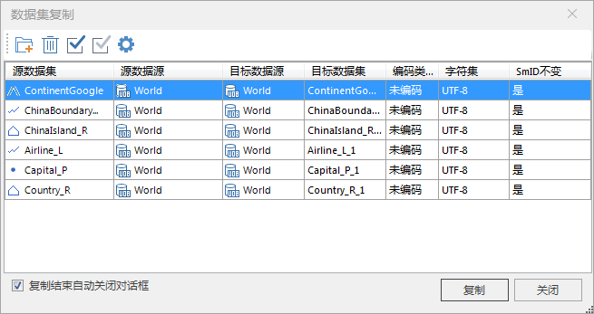

### 使用说明

“数据集复制”功能，用来将一个或者多个数据集复制到目标数据源中。当前有选中的数据集时，可以直接将选中的数据集添加复制窗口，快速实现数据集的复制。

同时支持以快捷键 Ctrl+C 和 Ctrl+V 的方式，即在工作空间管理器中选中待复制数据集进行 Ctrl+C（复制）， 再选中目标数据源进行
Ctrl+V （粘贴），完成对数据集进行复制、粘贴，将使数据源之间数据集的迁移更便捷简单。

### 操作步骤

  1. 在工作空间管理器中，选中要进行复制的数据集，可以配合使用 Shift 键或者 Ctrl 键同时选中多个数据集。 
  2. 右键单击选中的数据集，在弹出的右键菜单中选择“数据集复制...”项，弹出“数据集复制”对话框，如下图所示：    
---  
图：数据集复制对话框  
  3. 也可在工作空间管理器中，将待复制的数据集拖拽到需复制到的数据源结点处，弹出“复制数据集”提示框，单击“确定”按钮即可将将选中数据集复制到指定的数据源中。
  4. 如需复制其它数据集，在“数据集复制”对话框中单击“添加”按钮，在弹出来的“选择”对话框中，选择其它要复制的数据集，单击“确定”按钮后返回“数据集复制”对话框。 
  5. 在对话框中设置复制数据集的所必要的信息，对话框中的每条记录对应一个要复制的数据集的复制信息，包括：将数据集复制到的目标数据源、复制得到的新数据集的名称、复制得到的新数据集采用的编码类型。

对话框中的每条记录对应一个要复制的数据集的复制信息，记录中每一项的含义如下所示：

    * **源数据集：** 显示被复制的数据集的类型、名称和所在数据源的名称。
    * **源数据源：** 源数据集所在的数据源。
    * **目标数据源：** 目标数据源列用来指定被复制的数据集复制以后要存储在那个数据源中，目标数据源列中的每个单元格有一个下拉按钮，单击下拉按钮弹出下拉列表， 列表中列出了当前工作空间中打开的所有数据源，可以选择某个数据源来存放复制后的数据集。
    * **目标数据集：** 目标数据集列用来指定复制得到的新的数据集的名称，应用系统提供了一个默认的名称，用户可以对其进行修改，设置自己需要的名称。
    * **编码类型：** 编码类型列用来指定复制得到的新的数据集采用的编码类型，编码类型列中的每个单元格有一个下拉按钮，单击下拉按钮弹出下拉列表， 列表中列出了应用程序所支持的所有编码类型。数据集的编码类型就是数据集存储时的压缩编码方式，具体内容请参见：[数据集压缩编码方式](EncodeType.htm)。
    * **字符集：** 设置复制后数据集的字符格式，默认与被复制数据集相同，用户可以选择其它字符集来改变 复制后数据集使用的字符集。有关支持的字符集及其介绍，请参见：[字符集列表](Charset.htm)。
    * **SmID 不变：** 保持源数据集中 SmID 字段属性值不变。

对话框最上侧的区域显示是进行数据集复制操作的工具条，包括“添加”按钮、“移除”按钮、“全选”按钮、“反选”按钮、“统一设置”按钮。

工具条按钮说明

    *  按钮：用来向数据集复制对话框中添加需要复制的多个数据集，可以添加其他数据集进行复制。。
    *  按钮：用来移除对话框中选中的记录，即移除该记录对应的数据集的复制信息，从而取消该数据集的复制。
    *  按钮，用来选中对话框中所有的记录。
    *  按钮：用来反向选中对话框中的记录。
    *  按钮：当在对话框中选中了一条或多条记录后，单击该按钮，即可在弹出的“统一设置”对话框中，统一设置这些选中的记录对应的数据集的复制信息，包括：目标数据源、编码类型、字符集和 SmID 不变。

  6. 当设置完表格中所有要复制的数据集的复制信息后，就可以单击表格下方的“复制”按钮，根据所指定的信息完成数据集的复制。

###  注意事项

  1. 只有工作空间管理器中有选中的数据集，“数据集复制”按钮才可用。
  2. 当执行一次操作复制多个数据集时，在选择多个数据集时，只能选中同一个数据源下的多个数据集，不能跨数据源选择多个数据集。
  3. 将 UDB 数据源中的数据集复制到 Oracle 或 SQL Server 数据源中时，若数据集中有文本型字段，为了保证 UDB 中文本型字段中的多国语言可正常存储，数据集中的文本型字段会转换为宽字符型字段。

