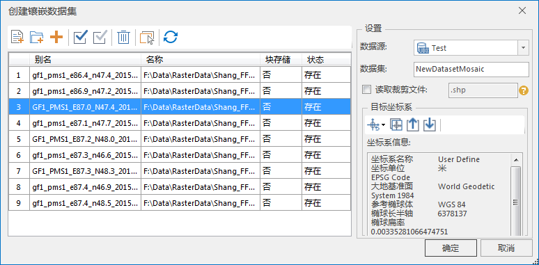
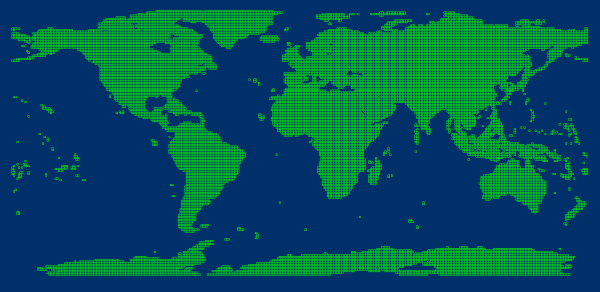
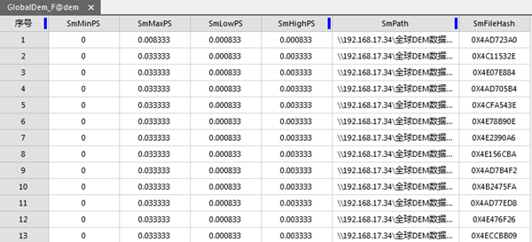
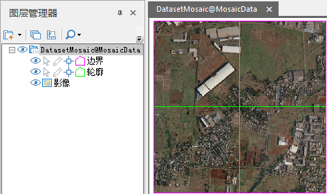

通过镶嵌数据集管理影像，可以当做影像入库的过程，入库就是将影像添加到镶嵌数据集中，可以将不同格式（.tif、.tiff、.img）的影像添加到同一镶嵌数据集中，并可以单次添加海量影像。

入库之所以高效，是因为镶嵌数据集并没有拷贝影像原文件，而是记录了影像的路径、轮廓、分辨率等元信息。

###  数据准备

入库前，首先您需要了解准备入库影像的基本情况，包括影像文件大小、文件数量、是否建立了金字塔等信息，为影像入库做充足准备。

  * 通过影像文件大小和文件数量，可以估测影像入库操作所需要的时间以及占用的磁盘空间。以下是通过测试结果提供的参考依据。全球30米分辨率的DEM数据，22667幅0.98TB，一次全部添加到UDB数据源中的镶嵌数据集，耗时14分钟；添加后，udb文件大小为16MB，udd文件22MB。
  * 影像是否创建了金字塔，以及影像是否采用的分块存储，这两方面都可以显著提升影像的显示效率，构建影像金字塔和影像转为分块存储，即可以在入库前完成，也可以在入库后进行，具体参见：3.5显示性能优化。
  * 影像的金字塔构建和分块存储的转换，以及后期影像地图缓存生成都支持多进程，因此，为了获得更高的执行效率，可以准备配置较高的机器执行这些操作。
  * 上述主要考虑了影像入库需要的各种资源，您还需要了解影像本身，影像所记录的内容是地物波普反射还是高程，这涉及后期影像地图配图采用哪种展示手段，例如，对于DEM数据，可以通过颜色表以及三维晕渲效果展示高程分级。
  * 查看影像投影信息，首先要确保影像数据投影信息是正确的，如果不正确需要进行处理，例如，测试过程中遇到一些影像，影像数据的投影信息明显不符合常理，南半球影像的投影信息明显是北半球投影信息，所以需要重新设置影像的投影为正确的投影；通过了解影像的投影信息，也方便为镶嵌数据集设置坐标系，使影像可以在该坐标系下正确拼接显示，例如：全球影像镶嵌数据集，影像原文件的坐标系为基于WGS1984的UTM分带投影，为了使影像动态拼接显示，这里需要将镶嵌数据集坐标系设置为它们统一的地理坐标WGS1984。

###  操作步骤

创建一个新的镶嵌数据集只有在当前打开的工作空间中有打开的数据源时才可用。

  1. 在“ **开始** ”选项卡的“ **新建数据集** ”组中，单击“ **镶嵌数据集** ”按钮 ,弹出“ **创建镶嵌数据集** ”对话框。
  
---  
图：“创建镶嵌数据集”对话框  
  2. 工具栏区域，提供了对添加到此数据集中的影像进行设置的工具，即可以添加新的影像数据，也可以删除已经添加的影像数据。镶嵌数据集将记录添加的影像文件的绝对路径信息。影像添加到镶嵌数据集后，将使用镶嵌数据集的地理坐标系进行显示，但并不对原始影像文件做任何修改。 
    *  按钮：添加指定的影像文件（*.img、*.tif、*.tiff等格式）添加到当前列表区域中。 
    *  按钮：添加指定文件夹下的所有影像文件。 

单击“添加文件夹”按钮，会弹出“添加文件夹”对话框，如下图所示。当通过添加文件夹的方式添加影像文件时，可以对文件夹的路径、影像文件的类型，以及添加文件夹中的影像文件时，是否搜索子文件夹中的文件进行统一设置。支持添加的影像文件类型包括：
IMG 文件、TIFF 文件。    
---  
图：“添加文件夹”对话框  
  
    *  按钮：添加指定的清单文件（*.txt、*.tif、*.tiff等格式）添加到当前列表区域中。 
    *  按钮：检查当前文件列表中的影像是否为块存储，检查结果将在“块存储”列显示。有关块存储的说明，请参考[影像数据转换为块存储。](ImageConvertToBlock.htm)
    *  按钮：刷新子数据集列表区域“状态”列中，各个子数据集的当前文件状态，即实际影像数据集或影像文件是否存在。

  3. 子数据集列表区域，显示了已添加子数据集的基本信息，包括：
    * **别名：** 子数据集添加到影像数据集集合中后，在此集合中显示的名称。
    * **名称：** 子数据集的名称。如果添加的子数据集是数据源中的数据集，则仅显示该影像数据集的名称；如果添加的子数据集是影像文件，则显示该影像文件所在的磁盘路径。
    * **状态：** 检查子数据集是否存在。当打开“创建镶嵌数据集”功能界面时，会自动检查各个子数据集对应的数据集或影像文件是否真实存在。
  4. 在“ **数据源** ”处可选择保存的数据源，在” **数据集** “输入新建镶嵌数据集名称。
  5. **读取裁剪文件** :即借助镶嵌数据集的裁剪子数据集，裁剪显示影像的有效区域。常用于影像数据在投影转换后导致变形，通过参考数集裁剪处理无值区域。该参考文件为*.shp 格式数据。 如若影像文件夹中存在对应的.shp文件，勾选该复选框，否则程序默认调用每个影像的轮廓数据作为裁剪范围。

  6. “ **目标坐标系** ”：当添加影像文件后，应用程序会将添加的第一个有坐标系的文件的坐标系设置为当前镶嵌数据集的坐标系。同时支持通过坐标系设置工具条中的“重新设定坐标系”、“复制坐标系”、“导入坐标系”等三种方式设置坐标系。

**坐标系信息** ：用于显示目标坐标系的详细参数信息。

* 单击“确定”按钮，完成镶嵌数据集的创建。在工作空间管理器数据源节点下新增创建后的镶嵌数据集的节点，分别是轮廓、边界和裁剪。

  * **轮廓** 是镶嵌数据集存储和组织影像文件的基础，它是一个面数据集，每一个面对像为单幅影像的地理范围，如下图所示，通过轮廓可以全局浏览影像的分布情况及覆盖情况。    
---  
图：全球范围的30米分辨率DEM数据（镶嵌数据集轮廓）  
  
除了地理范围，轮廓还管理了每幅影像文件的存储位置、金字塔的最大最小分辨率等元信息，如下图所示。在实际应用中，轮廓可能还需要管理影像的其他信息，如每幅影像的拍摄时间、厂商等，可以通过创建用户字段和字段更新来实现。

  
---  
图：轮廓数据集属性表  
  * **边界** ，为面数据集，其中的面对象可以用来设置镶嵌数据集的显示范围，默认基于轮廓构建；也可以通过自定义范围或者指定的几何对象重建边界，进而使镶嵌数据集按照新的边界显示边界以内的影像。 
  * **裁剪** ，为面数据集，其中的面对象是控制每幅影像的显示范围，是基于创建镶嵌数据集时选取的裁剪文件生成的，如若没有单独的裁剪文件，默认基于影像轮廓创建。 。 

* 在图层管理器中，一个镶嵌数据集包含三部分：边界线、轮廓线和影像。如下图所示，镶嵌数据集包含4幅影像数据集，显示在地图窗口中，其中，粉色线框为边界线、绿色线为轮廓线，最下方为镶嵌显示的影像数据集。
  
---  
图：镶嵌数据集结构  
  
  * **轮廓线** :影像轮廓线基于镶嵌数据集的空间参考，它反应的是影像在镶嵌数据集中的真实边界。
  * **边界线** :基于影像轮廓线构建。可以通过调整Boundary边界线范围动态改变镶嵌数据集的整体显示。在特定需求下，可利用已有矢量边界或行政区划替换原始镶嵌数据集边界，从而改变数据显示。
  * **影像** :添加到镶嵌数据集中管理的所有影像，动态镶嵌在一起显示。

### 相关主题

 [镶嵌数据集概述](MosaicDataset.htm)

 [镶嵌数据集显示](MosaicDatasetView.htm)

  

