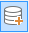

### 使用说明

矢量集合用来存储具有相同数据类型，相同投影坐标系的矢量数据集。应用程序支持在 UDB、OraclePlus、PostgreSQL
数据源中新建矢量集合，实质是建立一个可以存放多个矢量数据集的空数据集。创建成功后，可以将具有相同数据类型、相同投影坐标系的数据集加载到一个矢量数据集合中,其中子数据集必须是数据库型数据源中的数据集。常应用于大数据量的数据集管理，便于将不同数据源下的相同类型数据集集中管理并应用。

### 操作步骤

  1. 在“ **开始** ”选项卡的“ **新建数据集** ”组中，单击“ **矢量集合** ”按钮，即可创建一个新的矢量集合。该组中的按钮只有在当前打开的工作空间中有打开的数据源时才可用。
  2. 弹出“ **新建矢量集合** ”对话框。在对话框左侧的参数设置区域中，可设置矢量集合的基本参数，应用程序将使用这些参数来初始化新建的矢量数据集合，参数设置具体介绍如下：
  
---  
图：“新建矢量集合”对话框  
    * **目标数据源：** 存储新建矢量集合的数据源，该数据源只能是当前工作空间存在的 UDB 数据源（需以独占形式打开）、OraclePlus 及 PostgreSQL 数据库型数据源。
    * **数据集名称：** 设置新建矢量集合的名称，用户可以输入任何合法的名称作为新数据集的名称。
    * **子集类型：** 由于矢量集合中只能加载相同类型的矢量数据集，因此需在此处选择集合中数据集类型，目前支持点、线、面3种矢量数据类型供用户选择。
    * **坐标系设置：** 支持用户设置集合坐标系，单击  按钮，弹出“坐标系设置”窗口，设置集合的坐标系。具体操作参考[设置坐标系信息](../Projection/SetPrjCoordSys.htm)。
      * 如若不单独设置集合坐标系，该集合坐标系默认为所选数据集列表中第一个数据集的坐标系信息。
      * 当所添加的数据集与矢量集合的坐标系不一致时，不能加入集合。
  3. 在对话框右侧的子数据集列表区，通过工具可进行子数据集的"添加"、“全选”、“反选”、“移除”、”排序“等操作。 **注：** 子数据集必须是数据库型数据源中的数据集。 
    * 通过 "添加数据集"按钮，添加子89数据集。在弹出的“选择”对话框中，对话框左侧数据源列表中显示的为当前工作空间中存在的数据库型数据源。在对话框右侧数据集列表区中显示的即为该数据源下的同选定子集类型相同的数据集类型。
  
---  
图：“选择数据集”对话框  
    * 单击“确定“按钮完成一个数据源中的数据集添加。重复上述步骤，在数据源列表中切换不同的数据源，选择对应数据源下的数据集添加至矢量集合的数据集列表。
  4. 添加完成数据集子集，单击“确定”按钮，即可创建一个已添加了子数据集的矢量集合。
  5. **矢量集合管理** ：在工作空间管理器中，选择新创建的矢量集合，单击右键“管理矢量数据”项，打开“矢量集合管理”窗口，在该窗口可对集合中的数据集进行添加、删除等操作。
  
---  
图：“影像数据集集合”属性窗口  
  6. **矢量集合属性信息** ：在工作空间管理器中，选择新创建的矢量集合，单击右键“属性”项，打开该数据集合的属性窗口，属性窗口中会显示：数据集、坐标系、矢量集合、值域四个面板，每个面板都显示了属性面板数据结点中选中的数据集信息。其中“矢量集合面板”中显示如下信息： 

**子集个数：** 显示该矢量集合中包含的子集个数。单击“设置”按钮，弹出“矢量集合管理”窗口，可对数据集合进行管理。

**子集类型：** 显示该矢量集合的数据集类型。

