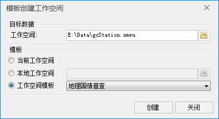

SuperMap
提供了基于模板创建工作空间的功能，基于指定模板创建的工作空间与模板工作空间中的数据源、数据集、地图、布局、场景一致。创建的工作空间与模板工作空间的异同点如下：

  * 数据源名称、投影等属性与模板中的数据源一致；
  * 数据源中的数据集个数、类型、名称、属性表结构、投影、字符集、编码、值域等属性与模板中的数据集一致；
  * 新建工作空间中的数据集对象个数为 0，数据范围为空，索引类型为无空间索引。

基于模板创建工作空间功能入口有两个，一个是在“开始”选项卡“工作空间”组的“文件”下拉选项中，单击“基于模板创建...”选项；二是在“起始页”的“工作空间”模块中，单击“模板创建”按钮。通过上述任意一种方式都可打开“模板创建工作空间”对话框，具体参数说明如下：

  * 目标数据：用于设置新创建的工作空间保存的路径和名称，工作空间中的数据源保存在于工作空间同级的目录中。
  * 模板：选择工作空间模板，SuperMap提供了三种选择方式，用户可根据需求进行选择： 
    * 当前工作空间：选择该单选框则表示以当前工作为模板。
    * 本地工作空间：单击右侧按钮，在本地文件中选择一个工作空间作为模板，或在文本框中直接输入模板工作空间的路径和名称。
    * 工作空间模板：SuperMap 根据国标提供了两种模板，一种是地理国情普查模板，一种是基础地理信息地形要素模板。  
    
  
---  

