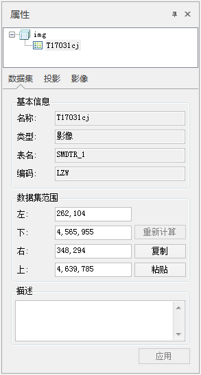
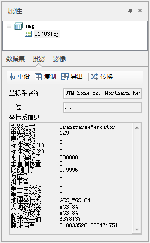
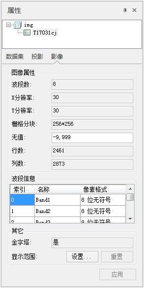
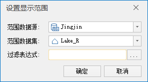

如果数据集属性窗口显示的是一个或者多个影像数据集的信息，则“属性”窗口中有三个模块内容： 数据集信息、投影、影像信息
，每个模块都显示了对应的信息内容。下面详细介绍各类信息的具体内容：

数据集属性信息

  1. 在“属性”窗口中单击“数据集”，即可查看当前选中影像数据集的属性信息，如下图所示。 
  
---  
图：影像数据集属性信息  
  
**基本信息：**

    * **数据集名称：** 显示影像数据集的名称。
    * **数据集类型：** 显示数据集的类型。
    * **数据表名：** 对于数据库型数据源，显示此数据集在数据库中所对应数据表的名称；对文件型数据源，显示此数据集属性表的名称。
    * **编码方式：** 显示影像数据集的编码方式，即数据集存储时的压缩编码方式，有关数据集的编码方式的详细内容，请参见：[数据集存储时的压缩编码方式列表](EncodeType.htm)。

**数据集范围：**

    * 上、下的值为沿 Y 轴方向（即‘Y=’）的两个边界；左、右的值为沿 X 轴（即‘X=’）方向的两个边界，数值的单位与数据集的单位相同。可直接输入数值进行修改，单击属性窗口右下角的“应用”按钮即可生效。
    * **复制粘贴** ：单击“ **复制** ”按钮可复制当前数据集范围，也可单击“ **粘贴** ”按钮，即可将复制范围的左、下、右、上值设置到当前范围。

**数据集描述：**

    * **数据集描述：** 显示影像数据集的描述信息，用户可以编辑数据集的描述信息。

投影信息

  1. 单击“属性”窗口中的“投影”，即可将面板显示内容切换为当前选中影像数据集投影信息，如下图所示。    
---  
图：影像数据集投影信息  
    * **坐标系名称：** 显示影像数据集的坐标系信息。
    * **地理单位：** 显示影像数据集的距离单位。
    * **坐标系信息：** 显示影像数据集投影的详细描述信息。
  2. 坐标系信息显示区域上方的按钮功能说明： 
    * **重设：** 单击此按钮，弹出“投影设置”对话框，重新设置该数据集的坐标投影信息。具体设置方法，参见[“投影设置”窗口](../Projection/PrjCoordSysSettingWin.htm)。 
    * **复制：** 单击该按钮，弹出“复制坐标系”对话框，可复制坐标系信息作为当前数据集的投影信息。系统提供了3种复制坐标系的方式：复制当前工作空间中已有数据源坐标投影信息、复制当前工作空间中已有数据集的坐标投影信息、从本地复制指定的投影信息文件。系统支持7种投影信息文件，分别是：TIFF文件（*.TIF）、SIT文件（*.SIT）、Erdas Image文件（*.IMG）、ArcView shape 文件（*.SHP）、MapInfo交换格式（*.MIF）、MapInfo TAB 文件（*.TAB）、投影信息文件（*.XML）。    
---  
    * **导出：** 导出数据集投影为投影信息文件（*.xml）。
    * **转换：** 单击此按钮，弹出“投影转换”对话框，转换选中数据集的当前投影信息。具体设置方法，参见[投影转换](../projection/ConvertPrjCoordSys.htm)中关于“投影转换”对话框的操作说明。

影像

  1. 单击“属性”窗口中的“影像”面板，窗口将显示该影像数据集的图像属性信息。
  
---  
图：影像数据集图像属性  
  
**图像属性：**

    * **波段数：** 显示多波段影像数据集所包含的波段的数目。
    * **X 分辨率：** 显示影像数据集 X 方向的分辨率。
    * **Y 分辨率：** 显示影像数据集 Y 方向的分辨率。
    * **栅格分块：** 显示了当前影像数据集栅格分块的大小，如上图所示，每256*256个象素会存储为一个栅格块，进行数据处理时一个栅格块一起处理。
    * **无值：** 显示影像数据集指定波段的无值。
    * **行数：** 显示影像数据集像元阵列的行数。
    * **列数：** 显示影像数据集像元阵列的列数。

**波段信息：**

    * **索引：** 显示多波段影像数据集当前所显示的波段的索引值。
    * **名称：** 显示影像数据集各个波段名称。
    * **像素格式：** 显示影像数据集的影像数据存储的像素格式，即每个像素采用多少比特（bit）进行表示。

**其它：**

    * **金字塔：** 显示影像数据集是否已创建金字塔。
    * **显示范围：** 用于设置栅格数据集在地图中的显示范围。对选中的栅格数据集设置显示范围后，该栅格数据集将仅显示所设范围内的信息，而其余部分是不可见的。 

单击右侧的“设置”按钮，会弹出“设置显示范围”对话框，可以将当前工作空间的某一面数据集作为所选栅格数据集的显示范围；也可以单击过滤表达式右侧的
 按钮，则弹出 SQL
表达式对话框，在该对话框中设置过滤表达式，以此控制栅格数据集的显示范围，具体内容请参见[SQL
表达式对话框](../../Query/SQLDia.htm)。

  
---  
  
单击“重置”按钮，可将数据集显示范围重置为完整显示数据集。

