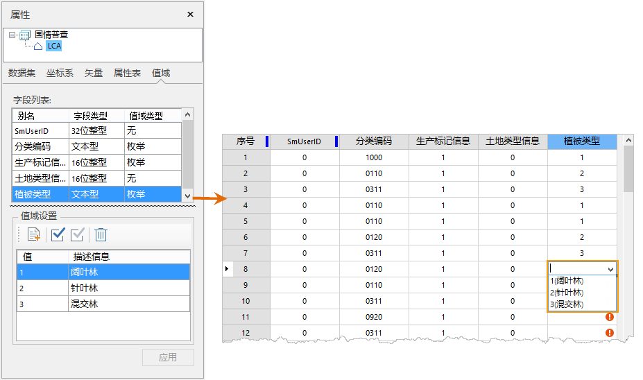
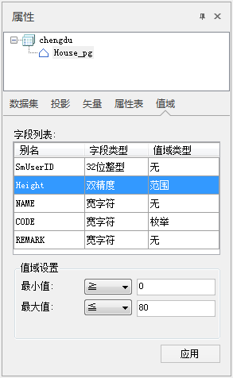

---
id: DTgroupDiaVector
title: 矢量数据集属性窗口  
---  
若工作空间管理器中选中的是一个或多个矢量数据集，数据集属性面板中会显示：数据集、坐标系、矢量、属性表、值域五个面板，每个面板都显示了属性面板数据结点中选中的数据集信息。下面详细介绍了各类信息的具体内容：

### 数据集信息

单击属性面板中的“数据集”选项，则面板中将显示该矢量数据集的属性信息，包括矢量数据集的基本信息、数据集范围信息以及数据集的详细描述信息。

**基本信息：**

  * **数据集名称：** 显示矢量数据集的名称。
  * **数据集类型：** 显示矢量数据集的类型。
  * **数据表名：** 显示矢量数据集的属性表的名称。
  * **编码方式：** 显示矢量数据集的编码方式，即数据集存储时的压缩编码方式，有关数据集的编码方式的详细内容，请参见：[数据集压缩编码方式](EncodeType)。

**数据集范围：**

  * 上、下的值为沿 Y 轴方向（即‘Y=’）的两个边界；左、右的值为沿 X 轴（即‘X=’）方向的两个边界，数值的单位与数据集的单位相同。数据集范围支持重新计算、复制粘贴，具体说明如下： 
    * 重新计算：可根据数据集中空间对象的位置重新计算矢量数据集范围，详细说明请参见[重新计算矢量数据集的范围](DTv_Recalculate)。
    * **复制粘贴** ：单击“ **复制** ”按钮可复制当前数据集范围，也可单击“ **粘贴** ”按钮，即可将复制范围的左、下、右、上值设置到当前范围。

**数据集描述：** 显示矢量数据集的描述信息，用户可以编辑数据集的描述信息。

### 坐标系

单击属性面板中的“坐标系”选项，则面板中将显示该矢量数据集的坐标系信息。

  * **坐标系名称：** 显示矢量数据集的坐标系信息。
  * **单位：** 显示矢量数据集的距离单位。
  * **坐标系信息：** 显示矢量数据集投影的详细描述信息。

坐标系信息工具栏处的按钮功能说明：

  * **重新设定坐标系：** 单击此按钮，可在下拉列表中坐标系重新设定，也可点击“更多”按钮，弹出“坐标系设置”对话框，重新设置该数据集的坐标投影信息。具体设置方法，参见[“投影设置”窗口](../projection/PrjCoordSysSettingWin)。 
  * **复制坐标系：** 单击该按钮，弹出“复制坐标系”对话框，可复制坐标系信息作为当前数据集的投影信息。系统提供了2种复制坐标系的方式： 
    * 复制当前工作空间中已有数据源坐标投影信息。
    * 复制当前工作空间中已有数据集的坐标投影信息。
  * **导出坐标系：** 导出数据集投影为投影信息文件（*.xml）。
  * **导入坐标系：** 导入投影信息文件（*.xml）为数据集投影。
  * **投影转换：** 单击此按钮，弹出“投影转换”对话框，转换选中数据集的当前投影信息。具体设置方法，参见[投影转换](../projection/ConvertPrjCoordSys)中关于“投影转换”对话框的操作说明。

### 矢量

单击“属性”面板中“矢量”选项，面板将显示该矢量数据集的信息。

**矢量数据集：**

  * **对象个数：** 显示矢量数据集中所有对象的数目。
  * **字符集：** 显示矢量数据集所使用的字符集，单击下拉按钮弹出下拉菜单，下拉菜单中列出了所支持的所有字符集，用户可以选择其中的字符集来改变矢量数据集当前使用的字符集。有关支持的字符集及其介绍，请参见：[字符集列表](Charset)。
  * **索引类型：** 显示矢量数据集的空间索引类型。有关矢量数据集的空间索引类型，请参见：[空间索引类型](SpatialIndexType)。
  * **只读：** 显示矢量数据集的只读状态，如果复选框为选中状态，表示数据集为只读的，只读状态的数据集不允许进行编辑操作，如添加、编辑、删除对象等，用户可以编辑数据集的只读状态，即通过选中和取消选中复选框的方式来改变数据集的只读状态。
  * **用户缓存：** 显示矢量数据集是否使用了缓存机制，如果复选框为选中状态，表示数据集使用了缓存，用户可以编辑该项，通过选中和取消选中 复选框的方式来改变数据集是否使用缓存。注意：只能对建立了图库索引的 Orcale Plus 数据源中的数据集有效。
  * **清除缓存：** 单击“清除缓存”按钮，会清除矢量数据集的缓存文件。

**数据集容限：**

  * **节点容限：** 显示和设置工作空间管理器中当前选中的矢量数据集中两个节点间的最小距离，当两个节点之间的距离小于节点容限时，在拓扑处理中两个节点将合并为一个节点。数值的单位与数据集的单位相同。
  * **短悬线容限：** 显示和设置工作空间管理器中当前选中的矢量数据集的短悬线容限，该容限用于判断悬线是否为过头线，如果悬线的长度小于此容限，则其为过头线，在拓扑处理中会可以设置去除过头线。数值的单位与数据集的单位相同。
  * **长悬线容限：** 显示和设置工作空间管理器中当前选中的矢量数据集的长悬线容限，该容限用于判断长悬线是否需要延伸到节点。如果长悬线的悬点到另一条线或弧段的距离小于此容限，通过拓扑处理，可以将长悬线延伸，并在与另一条线或弧段相交处生成一个节点。数值的单位与数据集的单位相同。
  * **颗粒容限：** 显示和设置工作空间管理器中当前选中的矢量数据集的颗粒容限，该容限用于控制圆、弧线或曲线上节点之间的距离，主要用在参数化对象转为线对象时的控制生成的节点间的距离。 数值的单位与数据集的单位相同。
  * **多边形容限：** 显示和设置工作空间管理器中当前选中的矢量数据集的最小多边形容限，又称为碎多边形容限，对封闭的线对象和面对象有效。该容限定义了拓扑处理时的碎多边形的大小，若多边形的面积与周长的比值小于该容限值，则被认为是碎多边形。在拓扑处理时，可以设置将碎多边形删除。

### 属性表

单击属性面板中的“属性表”选项，在属性表面板将显示工作空间管理器中所选中的矢量数据集的属性表的结构，即属性表的字段结构，主要以表格的形式显示。

表格中的每一行（每一条记录）为属性表中一个属性字段的相关信息，表格中的每一列代表属性字段的一类信息，主要包含以下信息：

  * **序号** ：表格中每一行的编号。
  * **名称** ：为属性表中属性字段的名称，当建立一个新的属性字段时，可以设置属性字段的名称，当属性字段创建成功后，属性字段的名称不可以被修改。字段命名必须遵循一定的命名规：（1）只能以汉字、字母、数字和下滑线命名，不能以数字，下划线及“sm”开头；（2）长度不得为0，不得超过30个字节；（3）不能有非法字符；（4）不能与各个数据库的保留字段冲突。有关字段和数据集的命名规则，请参见[数据库的保留关键字列表](DatabaseKeyWords)。
  * **别名** ：为属性表中属性字段的别名称，别名称主要作为属性表中属性字段的显示名称。
  * **类型：** 为属性表中属性字段值的类型。如果“字段类型”列中的单元格可编辑，单击选择单元格，然后再次单击鼠标，相应的单元格右侧将出现下拉按钮，单击下拉按钮弹出下拉菜单，菜单中列出了所支持的字段类型，此时，用户可以选择某种字段类型来更改对应字段的字段类型。对于数据库型数据源中的数据集，由于数据库本身的限制，目前仅支持修改PostgreSQL、OraclePlus、SQLServer、DMPlus、MySQL、PostGIS六种数据库引擎的数据集字段类型，在修改已有字段的类型时，请详见:[字段类型及修改情况](DTgroupDiaVector_ModifyType)。
  * **长度：** 为属性表中属性字段值的最大长度，只有当字段类型为“文本型”时，才能设置字段值的最大长度。如果“长度”列中的单元格可编辑，单击选择单元格，然后再次单击鼠标，相应的单元格 变为可编辑状态，此时，用户可以更改对应字段的字段长度值。
  * **缺省值：** 为属性表中属性字段值的默认值，即当在属性表中添加一条新的记录时，如果还未给该字段赋值，则该条记录相应的字段值将使用此缺省值作为字段值。如果“缺省值”列中的单元格可编辑，单击选择单元格，然后再次单击鼠标，相应的单元格 变为可编辑状态，此时，用户可以更改对应字段的缺省值。
  * **必填：** 属性表中的属性字段是否为必填字段，即必须为属性表中该属性字段赋值，属性表中在字段值不能为空。 如果“必填”列中的单元格可编辑，单击选择单元格，然后再次单击鼠标，相应的单元格右侧将出现下拉按钮，单击下拉按钮弹出下拉菜单， 此时，用户可以选择设置对应字段是否为必填字段。

* 用户可通过工具栏中的“添加”、“插入”、“修改”、“删除”等按钮对字段属性进行管理。

  * **添加** 按钮：用来为属性表添加一个新的字段，单击该按钮后，将在表格最后追加一行，设置新字段的各项信息，即可为属性表添加一个新的字段。
  * **修改** 按钮：选中表格中的某个单元格后，单击“修改”按钮或双击修改单元格，选中单元格将自动变为可编辑状态。 

支持对文件型数据源中的非系统字段的字段名称、字段类型、缺省值及是否必填等参数进行修改。

    * 对于从数据集中得到的属性字段信息，除属性字段的别名外，名称和其他信息都是不可以修改的；
    * 属性字段的别名可以不唯一，即不同的属性字段可以有相同的别名，而名称是用来唯一标识一个字段的，所以修改后的属性字段的名称不可以跟其他字段重名。
  * **上移、下移** 按钮：用来调整属性表中的字段显示顺序。
  * **删除** 按钮：用来属性表结构的表格中选中的一条或者多条记录，即删除矢量数据集的属性表中相应的字段。选中要删除的字段后，单击“删除”按钮，将弹出提示对话框，确认用户是否真的删除选中的字段，单击对话框中的“确认”按钮即可完成删除操作。
  * **超链接** 按钮：支持将文本型或宽字符型属性字段设置为超链接，详细描述请参见[超链接](../../Visualization/BrowseMap/Hyperlink)页面描述。
  * **应用** 按钮：应用当前对矢量数据集属性表结构的所有修改，包括新增、删除属性表字段和修改字段的信息。

###  值域

单击属性面板中“值域”选项，面板将单独显示该矢量数据集字段的值域信息，包括矢量数据集的字段别名、字段类型、值域类型及值域设置。

字段列表中显示了数据集的可编辑字段的字段别名、字段类型及值域类型，值域设置的操作说明如下：

  * **值域类型：** ：用于显示和设置字段的值域类型。在字段列表中选中某个字段，单击“值域类型”列中的单元格，再单击单元格中的下拉按钮，在下拉列表中可设置该字段的值域类型，提供的值域类型包括范围、枚举、无三种。若字段类型不是数值型，则值域类型支持设置为枚举或无值域；若字段类型为数值型，则值域类型可设置为范围、枚举或无值域。 
    * **枚举** ：设置值域类型为枚举型后，可在“值域设置”文本框中设置枚举值，每一行为一个枚举值，可设置每个枚举值的描述信息。设置枚举值之后，在属性表中编辑字段单元格值时，可选择下拉项中的枚举值进行赋值。       

       

    * **范围** ：设置数值型字段的值域类型为范围后，可在对话框右侧“值域设置”处设置字段值的最大、最小值范围即可。   
       

    * **无** ：表示该字段没有值域范围。

**注意** ：对字段设置值域范围后，若该字段中单元格数值不在设置的范围内，则属性表单元格中会提示：“该字段值不在值域范围内！”。

* 设置完字段值域后，单击“ **应用** ”按钮即可保存字段的值域设置。

###  备注

在创建字段类型为二进制型的字段时，有关字段长度的设置是无效的。
