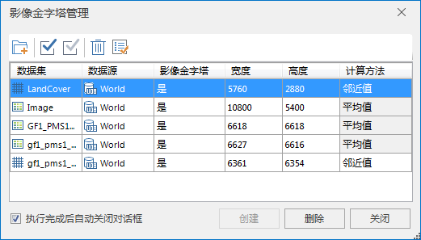

### 使用说明

“创建影像金字塔”命令，用来对栅格/体元栅格/影像数据创建影像金字塔，以提高数据浏览速度。支持创建的数据包括数据源中的栅格/体元栅格/影像数据集、以及以数据源形式直接打开的栅格文件（目前支持
tiff、tif、img 格式），同时支持添加本地影像文件来创建金字塔。

### 操作步骤

    1. 单击“ **开始** ”选项卡中“ **数据处理** ”组的“ **影像金字塔** ”按钮，弹出“ **影像金字塔管理** ”窗口，如下图所示：
  
---  
图：影像金字塔管理窗口  
    2. 在“影像金字塔管理”窗口中，可通过三种方式添加数据创建影像金字塔： 
      * 单击“添加”按钮 ，在弹出的“选择”对话框中选择要创建影像金字塔的文件，支持选择多个文件批量进行创建。选择完成后，单击“确定”按钮，返回“影像金字塔管理”窗口。
      * 单击“添加文件”按钮 ，在弹出的“打开”对话框中选择本地要创建影像金字塔的文件，支持选择多个文件批量进行创建。
      * 单击“添加文件夹”按钮 ，在弹出的“添加文件夹”对话框中添加指定文件夹下的所有影像文件。通过添加文件夹的方式添加影像文件时，可以对文件夹的路径、影像文件的类型，以及添加文件夹中的影像文件时，是否搜索子文件夹中的文件进行统一设置。支持添加的影像文件类型包括： IMG 文件、TIFF 文件。
    3. 选择的栅格文件会自动添加到“影像金字塔管理”窗口的列表中，并读取文件的宽度和高度，以及是否已经存在影像金字塔等信息。对于不存在影像金字塔的文件，可以直接单击“创建”按钮，执行创建影像金字塔的操作。否则，请先删除已有的影像金字塔，然后重新创建影像金字塔。 

**注意** ：无法删除以文件方式添加进来的影像文件的金字塔，请直接删除影像所在文件位置对应的*.vor 文件。

    4. 支持设置计算方法，程序提供“平均值”和“邻近值”两种计算方法，其中 **栅格数据集** 只支持“ **邻近值** ”计算方法， **体元栅格** 只支持“ **平均值** ”计算方法。

     **或者通过右键菜单创建影像金字塔，操作步骤如下：**

    1. 右键单击选中工作空间管理器中的一个栅格/影像数据集结点，在弹出的右键菜单中选择“ **创建影像金字塔** ”命令。程序将自动执行创建影像金字塔操作。
    2. 在“输出窗口”给出创建成功/失败提示信息。

### 注意事项

若数据已创建影像金字塔，则创建不可用，删除可用；反之创建可用，删除不可用。

