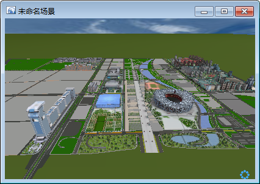
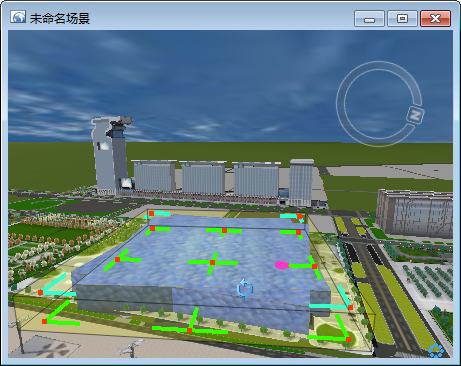

CAD 模型数据集是 SuperMap 新增的一种数据集模式，将 CAD
模型转化为数据集进行存储，使三维模型能够和其他类型的数据集在管理和操作上实现统一，同时在显示效率上更加高效流畅。 支持在场景中显示和编辑 CAD
模型数据集。

### 显示 CAD 模型数据集

  * CAD 模型数据集必须加载到场景中。在二维地图窗口中打开时，不能真实地显示模型。

下图所示为 CAD 模型数据集在场景中的显示效果：

  
---  

### 编辑 CAD 模型数据集

对于加载到场景中的 CAD 模型数据集，可以直接对其进行编辑，拉伸、移动、旋转、删除等。但是不能通过编辑的方式，改变单个模型的底部高程。

  * 当鼠标变为  状态时，可以对模型进行旋转操作。
  * 当鼠标光标为  状态时，可以对模型进行平移操作。
  * 当鼠标光标为  或者  状态时，可以对模型进行拉伸。
  * 按住键盘的 Delete 键可以删除该模型。
  * 按住 Esc 键可以取消本次操作。

CAD 模型数据编辑的操作步骤：

  1. 在 CAD 模型数据集上，单击鼠标右键，在弹出菜单选择“可编辑”，使其处于可编辑状态。
  2. 选中 CAD 模型数据集中要编辑的模型，对其进行编辑。

如下图所示，对选中的模型进行旋转操作的效果。

  
---  

