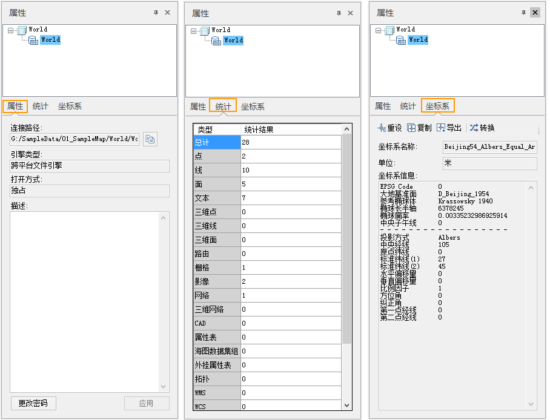
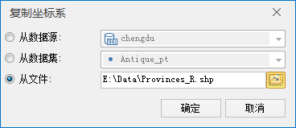

当在工作空间管理器中选择了一个或者多个数据源后，右键单击该数据源，在弹出的右键菜单内选择“属性”选项，在工作空间右侧弹出“属性”窗口，初始显示的是当前选中的数据源的相关信息，称为数据源属性窗口。

**注意：**
“属性”窗口是一个浮动窗口，该窗口不仅可以用来显示工作空间管理器中选中的一个或多个数据源的信息，工作空间、数据集等属性信息也通过该“属性”窗口来显示，通过右键单击选中的数据源或工作空间，在弹出的右键菜单内选择“属性”选项，就可以调出该“属性”窗口，并且初始显示的内容为当前选中的数据源信息，如果用户选中工作空间管理器中的工作空间，那么该“属性”窗口将显示该工作空间的相关信息；如果用户选中工作空间管理器中的一个或者多个数据集，那么该“属性”窗口将显示选中的数据集的相关信息。

下面详细介绍“属性”窗口中所显示的数据源信息，主要内容为：属性信息、坐标系信息和数据源中数据集的统计信息。

  
---  
图：数据源属性窗口  
  
“属性”窗口的上侧为一个树结构的目录，用来分类管理数据源信息，数据源属性窗口当前有三类信息：“属性信息”、“统计信息”和”坐标系信息“，
每一类信息对应的结点下的子结点为当前选中的数据源的别名称，单击目录树中的某个数据源结点，“属性”窗口右侧将显示对应的信息内容。下面详细介绍各类信息的具体内容：

属性信息

  1. 单击“属性”窗口左侧目录树中的“属性”结点下的任意一个子结点（数据源结点），窗口下侧区域将单独显示该数据源的属性信息。
    * **连接路径：** 显示数据源的存储位置。如果数据源为文件型数据源，则显示数据源文件的全路径；如果数据源为数据库型数据源，则显示数据源所在的数据库服务器名称。
    * **引擎类型：** 显示数据源的空间数据库引擎类型。有关数据源的引擎类型参见 [数据源引擎类型](EngineType.htm)。
    * **打开方式：** 显示数据源被打开时所使用的打开方式：只读/独占。
    * **描述：** 显示数据源的详细描述信息。用户可以对描述信息进行编辑。
    * **更改密码：** 对数据源进行密码管理，可以修改数据源的密码，需要输入原密码、新密码并确认新密码。

统计信息

* “统计信息”区域显示该数据源所包含的数据集的统计信息。

    * **总计：** 显示数据源的所包含的数据集的总个数。
    * 另外，表格列出了应用程序所支持的所有数据集的类型，每种数据集类型对应的单元格将显示相应的数据源所包含的这种类型的数据集的数目。

坐标系信息

  1. 单击“属性”窗口左侧目录树中的“坐标系信息”结点，窗口下侧区域显示数据源的坐标系名称、地理单位以及数据源坐标系的详细信息。可以在此导出或复制坐标系信息、重新设定坐标系或者进行坐标系转换。 
    * **坐标系名称：** 显示数据源的坐标系信息。
    * **地理单位：** 显示数据源的距离单位。
    * **坐标系信息：** 显示数据源投影的详细描述信息。
  2. 坐标系信息显示区域下方的按钮功能说明： 
    * **导出坐标系：** 导出数据源投影为投影信息文件（*.xml）。 
    * **复制坐标系：** 单击该按钮，弹出“复制坐标系”对话框，可复制坐标系信息作为当前数据源的投影信息。系统提供了3种复制坐标系的方式：复制当前工作空间中已有数据源坐标投影信息、复制当前工作空间中已有数据集的坐标投影信息、从本地复制指定的投影信息文件。系统支持7种投影信息文件，分别是：TIFF文件（*.TIF）、SIT文件（*.SIT）、Erdas Image文件（*.IMG）、ArcView shape 文件（*.SHP）、MapInfo交换格式（*.MIF）、MapInfo TAB文件（*.TAB）、投影信息文件（*.XML）。    
---  
    * **重新设定坐标系：** 单击此按钮，弹出“投影设置”对话框，重新设置该数据源的坐标投影信息。具体设置方法，参见[“投影设置”窗口](../Projection/PrjCoordSysSettingWin.htm)。 
    * **坐标系转换：** 单击此按钮，弹出“投影转换”对话框，转换选中数据源的当前投影信息。具体设置方法，参见[转换投影坐标系](../Projection/ConvertPrjCoordSys.htm)。

