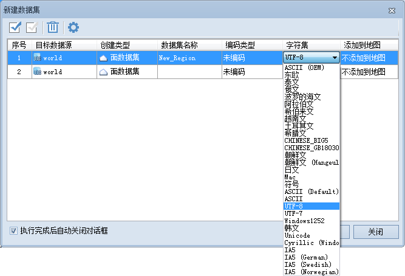
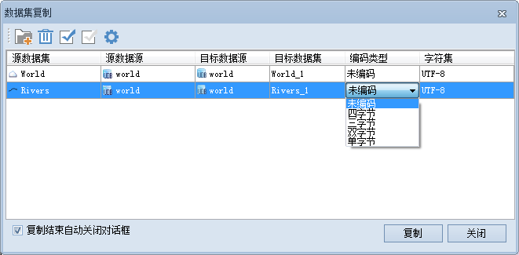
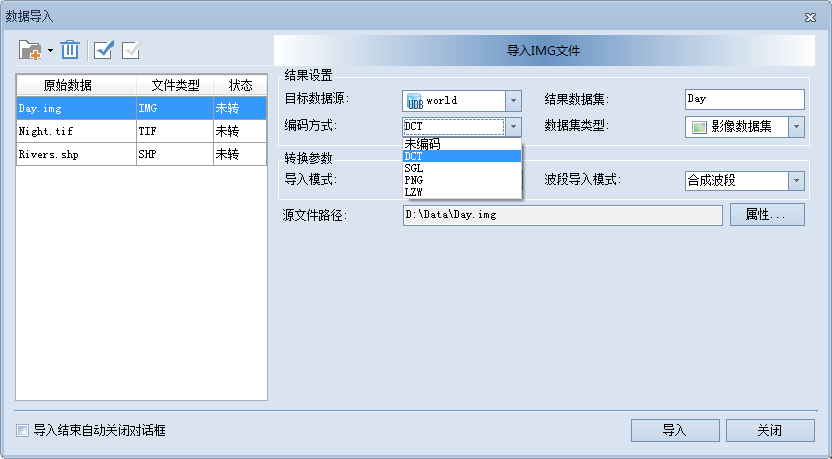
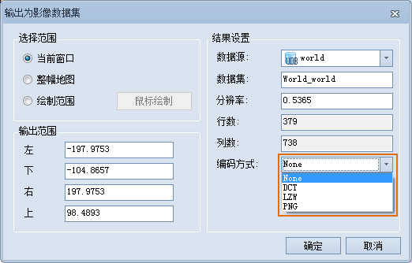

数据集编码方式可以通过新建数据集、复制数据集、导入数据集和导出影像数据集等功能进行修改，或者可以右键单击某一数据集，在属性信息窗口中查看该数据集的编码方式。

### 新建数据集

新建矢量数据集时，可以为其设置编码方式。对于不同类型的数据集，会下拉菜单中提供可用的编码方式。用户可根据需要选择合适的编码方式。

  
---  
  
### 复制数据集

复制数据集的同时，可以为其设置编码方式。对于不同类型的数据集，会下拉菜单中提供可用的编码方式，如下图所示。用户可根据需要选择合适的编码方式。

  
---  
  
不同类型的数据集和与其相匹配的编码方式参见下表：

**表1：不同类型的数据集的编码方式**  
数据集类型 | 编码方式  
矢量数据集 | 单字节、双字节、三字节、四字节  
DEM/Grid 数据集 | SGL,LZW  
影像数据集 | LZW,DCT,PNG  
  
### 导入数据集

外部格式的数据导入到 SuperMap 产品中时，可以选择编码方式，如下图所示。不同类型的数据集对应的编码方式如表1所示。

  
---  
  
其中，image 影像数据集的默认编码方式为 DCT 编码，其它格式的默认编码方式均为未编码。

### 导出影像数据集

在  中，在地图窗口内单击鼠标右键，在出现的右键菜单中选择“输出为影像数据集…”，其编码方式可选择 DCT、LZW、PNG 或者
None（即不采用编码），如下图所示：

  
---  
  

