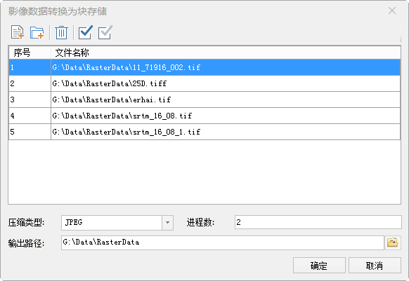
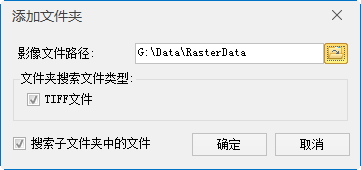

### 使用说明

影像数据转换为块存储能够提高加载和浏览影像数据的速度。主要用于镶嵌数据集的数据处理，优化镶嵌数据集的数据处理效率。
提供了将指定的影像数据存储方式转化为块存储，并保存到相应的 文件中。

### 操作步骤

    1. 在“ **数据** ”选项卡的“ **数据处理** ”组中，单击gallery中的“ **影像存储转换** ”按钮，弹出“影像数据转换为块存储”窗口，如下图所示。
  
---  
图：影像数据转换为块存储窗口  
    2. 在“影像数据转换为块存储”窗口中，可添加单个文件，也可批量添加数据文件。 
      * 单击按钮：在弹出的“打开”对话框中添加指定的影像文件（*.tif、*.tiff格式）添加到当前列表区域中。
      * 单击按钮：添加指定文件夹下的所有影像文件。

单击“添加文件夹”按钮，会弹出“添加文件夹”对话框，如下图所示。当通过添加文件夹的方式添加影像文件时，可以对文件夹的路径、影像文件的类型，以及添加文件夹中的影像文件时，是否搜索子文件夹中的文件进行统一设置。支持添加的影像文件类型只支持
TIFF文件格式。    
---  
图：“添加文件夹”对话框  
  
    3. 设置压缩编码类型。应用程序提供了三种编码类型：未编码、JPEG、LZW。具体哪种数据集适用哪种编码方式，请参见[数据集压缩编码方式](../DataManagement/EncodeType.htm)。
    4. 设置进程数：合理的进程数可以提高转化效率。默认值为2，可根据数据大小及本机空闲进程数的情况具体设置。
    5. 设置输出路径：单击组合框右侧按钮，设置输出文件保存路径，或直接在文本框中输入保存路径。
    6. 设置好以上参数后，单击对话框中的“确定”按钮，执行将列表中的指定影像文件转换为块存储文件的操作。

### 相关主题

 [影像存储转换](ImageStorageConversion.htm)

  

