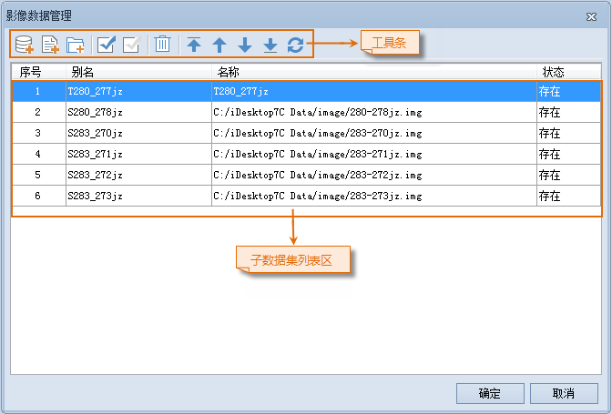

### 使用说明

管理影像数据功能用来实现对影像数据集集合中管理，包括添加子数据集、删除子数据集、子数据集排序、数据集追加等。

在通过影像数据集集合管理影像数据时，需注意以下内容：

    1. 加载到影像数据集集合中的影像文件或影像数据集，其投影坐标系必须与影像数据集集合保持一致。
    2. 加载到影像数据集集合中的影像文件或影像数据集，其波段数必须与影像数据集集合保持一致。。
    3. 影像数据集集合作为单一图层打开浏览，但包含在该集合的影像文件不能单独打开。
    4. 影像数据集的顺序，会影响影像数据集集合的显示效果。 

子数据集顺序的调整建议在创建集合金字塔之前完成，以减少对集合金字塔的创建和更新。

类似地，当调整子数据集的顺序，执行添加、删除子数据集等操作后，需重建整个影像数据集集合的影像金字塔或执行区域更新金字塔的操作。

    5. 影像数据集集合的操作类似于影像数据集，支持进行创建影像金字塔、删除影像金字塔等操作，以及设置图层属性。
    6. 在不同数据源之间，即跨数据源复制影像数据集集合后，需为复制得到的影像数据集集合重建影像金字塔。
    7. 不支持跨数据源向影像数据集集合中添加子数据集。

### 操作步骤

    1. 在工作空间管理器中，选择一个影像数据集合，单击右键“ **管理影像数据...** ”命令，弹出“ **影像数据管理** ”窗口。
  
---  
图：“影像数据管理”窗口  
    2. 工具条区域，提供了对添加到此影像数据集集合中的影像进行设置的工具，即可以添加新的影像数据集，也可以删除已经添加的影像数据集。 

选择添加的影像文件会自动添加到影像数据集列表区中，可以通过工具条对这些影像数据集的属性进行调整。

工具条按钮说明

      *  按钮：将影像数据集集合所在的数据源中的影像数据集，添加到当前列表中。 
      *  按钮：添加指定的影像文件（*.img、*.tif、*.tiff、*.png、*.jpeg等格式）添加到当前列表区域中。 
      *  按钮：添加指定文件夹下的所有影像文件。 

单击“添加文件夹”按钮，会弹出“添加文件夹”对话框，如下图所示。当通过添加文件夹的方式添加影像文件时，可以对文件夹的路径、影像文件的类型，以及添加文件夹中的影像文件时，是否搜索子文件夹中的文件进行统一设置。支持添加的影像文件类型包括：
IMG 文件、TIFF 文件、JPEG 文件、PNG 文件、GIF 文件和位图文件。    
---  
图：“添加文件夹”对话框  
  
      *  按钮：全部选中列表框中的所有数据集。 
      *  按钮：反选列表框中的数据集。 
      *  按钮：移除当前选中的记录。 
      *  按钮：将选中的记录移动至表格第一条。 
      *  按钮：将选中的记录向上移动一条。 
      *  按钮：将选中的记录向下移动一条。 
      *  按钮：将选中的记录移动至表格最后一条。
      *  按钮：刷新子数据集列表区域“状态”列中，各个子数据集的当前文件状态，即实际影像数据集或影像文件是否存在。

    3. 子数据集列表区域，显示了已添加子数据集的基本信息，包括： 
      * **别名：** 子数据集添加到影像数据集集合中后，在此集合中显示的名称。
      * **名称：** 子数据集的名称。如果添加的子数据集是数据源中的数据集，则仅显示该影像数据集的名称；如果添加的子数据集是影像文件，则显示该影像文件所在的磁盘路径。
      * **状态：** 检查子数据集是否存在。当打开“影像管理”功能界面时，会自动检查各个子数据集对应的数据集或影像文件是否真实存在。对于“不存在”状态的子数据集，可执行“同步影像数据”来影像数据集集合的调整。
    4. 完成设置后，单击“确定”按钮，即可将列表区中的影像数据集添加到影像数据集集合中，并返回“属性”窗口。数据集个数信息会同时更新。

