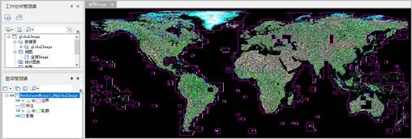
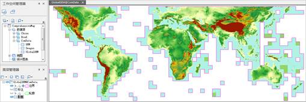

如今，影像的获取已越来越便捷、高效，针对海量影像的管理、服务发布的需求也越来越普遍。为了更便捷高效地完成这一工作， 提供了基于镶嵌数据集的解决方案。

镶嵌数据集采用元数据+原始影像文件的方式进行管理。把影像数据添加到镶嵌数据集时，只会在镶嵌数据集中记录影像文件的路径、轮廓、分辨率等元信息，在使用时才会根据元信息加载所需的影像文件。该模式相比传统的入库管理方式，大大提升了入库的速度，同时也减少了磁盘的占用。

### 镶嵌数据集特点：

* 镶嵌数据集用于管理栅格格式的数据，可以将不同格式（.tif、.tiff、.img）的影像添加到同一镶嵌数据集中，并可以单次添加海量影像。
* 添加到镶嵌数据集中的影像，可能坐标系不同，例如，下图全球影像镶嵌数据集，影像原文件的坐标系为基于WGS1984的UTM分带投影，为了使影像动态拼接显示，这里需要将投影设置为它们统一的地理坐标WGS1984，因此，需要在创建镶嵌数据集时指定它的坐标系为WGS1984地理坐标系。
  

* 使用镶嵌数据集管理海量影像，不仅影像入库效率高，而且磁盘空间占用小，测试结果显示：全球30米分辨率的DEM数据，22667幅0.98TB，一次全部导入到UDB数据源，耗时14分钟；导入后，udb文件大小为16MB，udd文件22MB。
  

### 相关主题

 [管理镶嵌数据集](MosaicDataManagement)

 [镶嵌数据集显示](MosaicDatasetView)

 [创建镶嵌数据集](CreateMosaicDataset)

