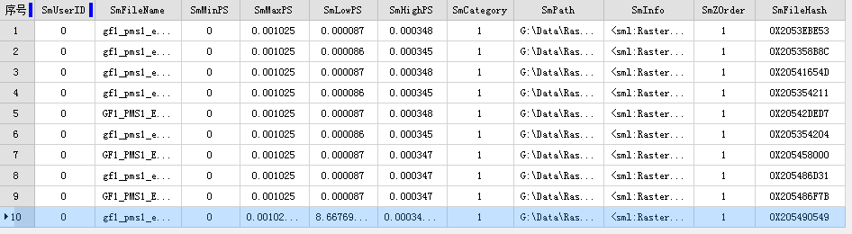

通过以下操作，可浏览轮廓属性表、添加镶嵌数据、重新指定路径、构建概视图、重建边界、清除数据、统计信息、导出数据、创建影像金字塔等。

###  浏览镶嵌数据集属性

选择数据源列表中的镶嵌数据集，右键单击“浏览轮廓属性表”，打开镶嵌数据集的属性表，该属性表其实是轮廓线的属性表，其中每一条记录对于一个轮廓对象。属性表主要字段内容:

    * **SmFileName** ：添加到镶嵌数据集中管理的所有原始影像的文件名称（不包括扩展名）以及概视图文件名称（包含扩展名）。
    * **SmPath** ：添加到镶嵌数据集中管理的所有原始影像文件的全路径（绝对路径）以及概视图文件全路径，这些路径支持网络共享路径。因此可以通过编辑该字段实现镶嵌数据集的共享使用。
    * **SmCategory** ：用于标识影像轮廓线内当前显示的图像时原始影像文件还是概视图，1标识原始影像文件；2表示概视图。 
    * **SmMinPS** ：定义图像的下限，因此，无法处理任何低于该值的图像请求。默认值是 0，但可以将其设置为更大的值，以限制可以访问图像的分辨率。如果发出低于此分辨率的请求，则请求失败，不返回图像。 
    * **SmMaxPS** ：定义图像的上限，因此，无法处理任何高于该值的图像请求。与最小像元大小的默认值不同，最大像元大小的默认值是数值较大的数。如果发出高于此分辨率的请求，则请求失败，返回灰色图像。 
    * **SmMinPS** 和 **SmMaxPS** ：SmMinPS和SmMaxPS定义像元大小范围。根据该范围确定镶嵌数据集使用哪一分辨率影像数据进行显示。系统根据影像金字塔和图像之间的叠加来计算SmMinPS和SmMaxPS值。 
    * **SmLowPS** 和 **SmHightPS** 两个字段定义了栅格数据集所包含的象元（像素）大小的实际范围，SmLowPS为影像真实分辨率，SmHightPS为影像金字塔分辨率。
  
---  
图：属性表  

###  添加镶嵌数据

在完成创建镶嵌数据集之后，可继续将.tif、.tiff、.img影像文件的添加至当前镶嵌数据集中。具体操作如下：

  1. 选择数据源列表中的镶嵌数据集，右键单击“添加镶嵌数据”，打开“添加镶嵌数据”对话框,在此对话框中可添加新的影像文件。工具栏区域，提供了添加影像工具按钮，可通过单个文件、文件夹及文件夹清单三种形式添加。
  
---  
图：添加影像数据  
  2. 影像文件列表添加完毕后，单击对话框中的“确定”按钮，影像文件路径等信息就写入镶嵌数据集中。
  3. 镶嵌数据集将记录添加的影像文件的绝对路径信息。影像添加到镶嵌数据集后，将使用镶嵌数据集的地理坐标系进行显示，但并不对原始影像文件做任何修改。

###  创建影像金字塔

为镶嵌数据集创建影像金字塔，目的是提高大批量影像数据的显示效率。程序会对原始影像按照某种规则构建多层金字塔，不同比例尺下显示相应分辨率的金字塔影像。且在镶嵌数据集构建概视图时，必须要求镶嵌数据集中的所有影像具有金字塔，以提高数据浏览速度。

  1. 选择数据源列表中的镶嵌数据集，右键单击“创建影像金字塔”,打开“创建影像金字塔”对话框,对创建影像金字塔的参数进行设置，包括重采样方法及线程数设置。程序提供了如下几种重采样的方法，各种方法的具体说明请参见[重采样方法介绍。](../../DataProcessing/Registration/resamplemethod.htm)
    * **无** ：不进行重采样。
    * **最领近法** ，将输入栅格数据集中最邻近的像元值作为输入值，赋予输出栅格数据集的相应像元。
    * **平均值法** ，计算所有有效值的均值进行重采样计算。
    * **高斯内核计算法** ，使用高斯内核计算的方式进行重采样，这种对于高对比度和图案边界比较明显的图像效果比较好。
    * **平均联合数据法** ，在一个magphase空间中平均联合数据，用于复数数据空间的图像的重采样方式。
  2. 设置参与创建金字塔的线程数，使创建影像金字塔更加高效。
  3. 完成参数设置，单击对话框中的“确定”按钮，执行创建金字塔。

###  构建概视图

为了提高镶嵌数据集的显示效率，数据默认小比例尺下只显示镶嵌轮廓线，不显示原始影像；

  1. 选择数据源列表中的镶嵌数据集，右键单击“构建概视图”,打开“构建概视图”对话框,对概视图最大宽度、最大高度、采样系数以及输出路径进行设置。
  
---  
图：构建概视图  
    * **最大宽度和高度** ：概视图影像文件的最大宽度和高度。
    * **采样系数** :相邻两层概视图的分辨率比率。
    * **输出路径** :概视图影像文件的存放路径。
    * **去除无值压盖** :多景影像拼接处可能存在无值区域与有值区域压盖导致黑边的情况，在创建概视图时，可指定无值的数值，在构建概视图后，获得正确的压盖区域显示效果。
  
---  
图：设置无值压盖对比图  
    * **多任务执行** ：支持设置开启多个进程来执行概视图的构建，提高构建速率，进程数需要根据机器的配置和进程使用情况来设置。
  2. 完成参数设置，单击对话框中的“确定”按钮，完成概视图的创建。镶嵌数据集构建概视图，是对原始影像按照某种规则重建多层金字塔，用于小比例尺下显示，构建了概视图后，在概视图输出路径下将产生影像文件，并且在轮廓子数据集的属性中，追加了概视图相关记录，包括概视图影像文件的文件名和路径、影像文件分辨率信息等信息。
  
---  
图：轮廓属性表中增加概视图记录  

###  重新指定路径

若镶嵌数据集中的原始影像文件位置发生变化，或需要重新指定生成概视图的路径，可通过“重新指定路径”对文件位置路径进行更改。

  1. 选择数据源列表中的镶嵌数据集，右键单击“重新指定路径”，打开“重新指定路径”对话框,在对话框中更改镶嵌数据集中已有文件列表中文件的路径，包括原始影像文件路径和概视图路径。
  
---  
图：重新指定影像数据  
    * **原始影像文件路径** :如果创建镶嵌数据集之后原始路劲的影像位置发生移动，或者将影像数据放于某个共享路径中时，只需要将此处文件路径更新为现数据所在路径，即可重新调取数据。
    * **概视图文件路径** ：更改存放概视图的存放位置。
  2. 影像文件路径选择完成后，单击对话框中的“确定”按钮，完成文件路径更新。

###  清除数据

  1. 选择数据源列表中的镶嵌数据集，右键单击“清除数据”,打开“清除数据”对话框,可选择“从镶嵌数据集移除所有记录（包括概视图）”删除所有数据，也可选择“仅删除概视图”把已创建的概视图从数据集中删除。
  2. 选择完成，单击对话框中的“确定”按钮，完成清除数据。

###  重建范围

当镶嵌数据集中的数据发生变化时，例如：删除某些影像、增加新的影像、影像存在裁剪范围数据等情况，单击此功能可对镶嵌数据集重建范围。有关重建范围的应用请参看[影像地图配置-
重建数据范围。](MosaicDatasetMapConfig.htm#2)

  1. 选择数据源列表中的镶嵌数据集，右键单击“重建范围”，打开“重新范围”对话框。
  
---  
图：重建范围  
  2. 重建范围对话框中提供三种范围更新选择：重建边界。重建轮廓、重建裁剪范围，用户可选择一种范围进行更新，同时支持多选。 
    * **重建边界** ：勾选该复选框可重建影像边界范围，设置边界重建范围可通过选择数据集范围和自定义范围两种方式。
      * **选择数据集范围** ：通过选择数据源中的面数据集作为重建范围。
      * **自定义范围** ：通过绘制范围和选择对象确定更新范围。点击右侧下拉按钮可选择“绘制范围”和“选择对象”两种方式选择边界更新范围。
    * **重建轮廓** ：勾选该复选框可重建镶嵌数据集轮廓范围。
    * **重建裁剪范围** ：勾选该复选框可重建裁剪范围。
  3. 单击“确定”按钮，执行重建范围操作。

###  统计信息

统计信息是为镶嵌数据集的显示设置不同的拉伸方式做数据准备。设置拉伸方式需要统计镶嵌数据信息，如若再此处没有统计信息，在设置镶嵌数据集显示拉伸方式时，系统会弹出提示框提示先统计镶嵌数据信息。具体操作方式如下：

  1. 选择数据源列表中的镶嵌数据集，右键单击“统计信息”，程序将逐个统计镶嵌数据集中影像的最大值、最小值、均值、标准差、方差等信息。
  2. 统计完成后，程序会在输出窗口提示“镶嵌数据统计信息完成”。 

###  导出数据

  1. 选择数据源列表中的镶嵌数据集，右键单击“导出数据”,打开“导出数据”对话框，程序提供了两种导出方式分别是：导出文件和导出文件清单。用户可根据需求选取一种导出形式。两种导出方式均支持设置以下参数：
    * **选择范围** ：可设置导出文件或文件清单的范围。通过选择整幅地图、在地图窗口绘制范围、选择对象以及通过复制、粘帖已有范围的坐标值四种方式。需要注意的是绘制范围必须保证镶嵌数据集处于地图打开状态。选择对象需要当前地图窗口中存在面数据集选择对象才可用。
    * **参数设置** :程序提供两种导出类型：仅导出影像数据和导出概视图。可选择其中一种，也可同时选择。即当选择导出文件方式时，导出的即为设置范围之内的影像数据和概视图数据。若选择导出文件清单，导出的即为设置范围之内的影像数据的文件列表及概视图文件列表。
    * **保存结果** ：设置导出数据的输出路径。 
    * **另存为数据集** :也可选择另存数据集，勾选此复选框，选择另存数据源及数据集。
  
---  
图：导出镶嵌数据  
  2. 单击对话框中的“确定”按钮，完成数据导出。

###  更新影像文件列表

当前镶嵌数据集中的数据发生变化，例如：需要删除某些影像、增加新的影像、或者影像文件的路径发生变化等，就需要通过下面的功能对镶嵌数据集进行更新。

  1. **添加镶嵌数据** ：为镶嵌数据集添加影像文件。
  2. **构建概视图** ：当镶嵌数据集中的文件发生变化后，重新构建概视图来更新概视图影像。
  3. **重新指定路径** ：修改镶嵌数据集中已有文件列表中文件的路径，包括原始影像文件路径和概视图路径。
  4. **清除数据** ：清除镶嵌数据集中所管理的影像列表，可以清除原始影像文件但保留概视图，也可以全部清除使镶嵌数据集为空。
  5. **重建边界** :在当前镶嵌数据集中的数据发生变化，例如：删除某些影像、增加新的影像等情况，需要重建数据的边界，单击此功能对镶嵌数据集边界进行更新。

###  相关主题

 [镶嵌数据集概述](MosaicDataset.htm)

 [镶嵌数据集显示](MosaicDatasetView.htm)

 [基于镶嵌数据集配置影像地图](MosaicDatasetMapConfig.htm)

 [创建镶嵌数据集](CreateMosaicDataset.htm)

  

