在将镶嵌数据集添加到地图窗口中显示时，包含海量影像数据的镶嵌数据集显示在地图窗口时，初始显示为全幅显示，并且只显示了拼接影像的轮廓，使地图放大到某个比例尺后，镶嵌数据集会根据当前显示范围，动态读取该范围内的影像文件，进行动态拼接显示。第一次浏览可能速度比较慢，但浏览后系统将建立缓存，再次浏览时效率很高。

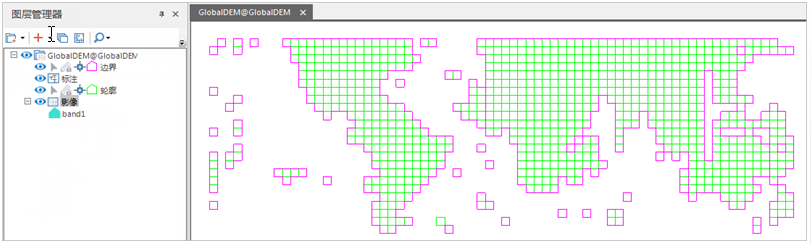  
---  
图：全幅显示镶嵌数据集  
  
当用户需要全局概览影像拼接后的效果时，可通过构建镶嵌数据集概视图，使它在小比例尺下可以显示影像拼接结果。有关构建概视图的有关操作，请查看[管理镶嵌数据集](MosaicDatasetManage.htm#5)页面。

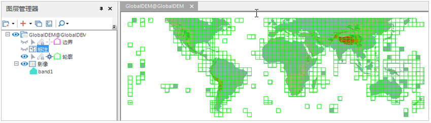  
---  
图：全幅显示镶嵌数据集（已构建概视图）  
  
###  去除影像无值

另外，有些遥感影像经过校正后，会出现无值区域，影响影像的拼接显示效果，用户可通过相关设置去除这些无值区域。影像无值情况可以概括分为两种，一种是影像内部的无值（图1）；一种是由于校正产生的影像有效区域外的无值(图2)。

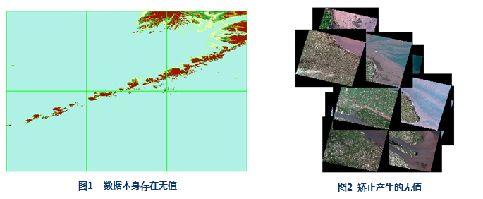  
---  
  
影像校正产生的无值区域影响了影像拼接显示的效果，需要去除；而数据本身无值一般不需要显示出来也需要去除。去除无值的方式有两种：无值透明方式和裁剪显示方式，要针对无值的具体情况选择合适的方式去除无值。

  1. **无值透明方式** :无值透明方式可以去除数据本身的无值，方法很简单，在图层管理器中，选中镶嵌数据集影像图层，打开图层属性面板，根据影像波段不同，属性面板中关于无值的指定也不同：对于单波段影像，直接指定无值即可；对于多波段，无值的值为多波段合成后的RGB值。设置无值后，就可以勾选“无值透明”去除无值区域。
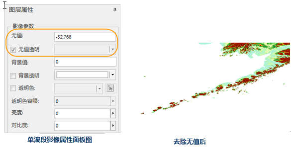  
---  
  2. **裁剪显示方式** :针对影像校正后产生的无值区域，可以通过裁剪显示方式，将影像非无值区域的矢量范围作为裁剪区，在显示时，裁剪区域内的影像将全部显示，裁剪区域外的影像内容不显示。 
    * **确定裁剪区** ：裁剪显示方式去除无值，需要应用镶嵌数据集的裁剪子数据集指定每幅影像的裁剪区，如下图所示:  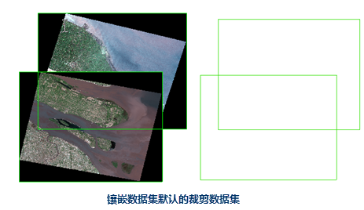  
---  
      * 按照上面的方式确定镶嵌数据集中每幅影像的裁剪区，这里称为裁剪形状，每幅影像的裁剪形状为一个面对象并单独存储在一个shapefile文件中，文件名称与影像文件名称相同，该.shp文件必须存储在对应影像文件的同级目录下。
      * 准备了影像裁剪形状.shp文件后，就可以对镶嵌数据集重建裁剪范围，镶嵌数据集默认的裁剪子数据集的内容基于影像轮廓构建。重建后，指定的裁剪形状将更新到裁剪子数据集中。选择镶嵌数据集右键菜单中的“重建范围”，打开“重建范围”对话框，然后，勾选“重建裁剪范围”并指定裁剪形状文件的扩展名.shp，执行重建操作。
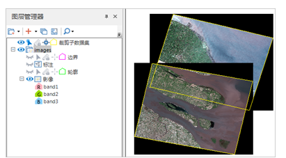  
---  
图：重建裁剪范围后裁剪子数据集与影像叠加  
    * **裁剪显示影像** :在影像图层属性面板进行如图“裁剪显示影像”所示的设置，勾选“逐文件绘制”，裁剪类型设置为“数据裁剪”，即可使用裁剪子数据集裁剪显示影像的有效区域。
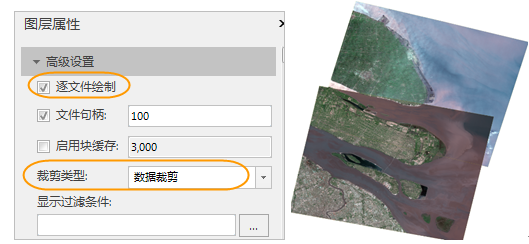  
---  
图：裁剪显示去除校正产生的无值  

###  显示效果设置

镶嵌数据集影像显示效果设置与普通影像设置基本一致，一般镶嵌数据集影像显示效果的调整包括：特殊值显示、颜色表显示、拉伸显示等，还可以设置栅格函数，快速获得三维晕渲图和正射影像图效果。镶嵌数据集影像显示效果设置都是通过影像图层属性面板实现。

  * **特殊值显示** :对影像特殊值，既可以处理为透明也可以使用其他颜色替代显示。通过影像图层属性面板的背景值设置，对于多波段影像特殊值形式为三波段合成后的RGB值；确定裁剪区然后，选择特殊值显示效果，勾选“背景透明”特殊值透明显示，或者选择颜色替代显示特殊值。
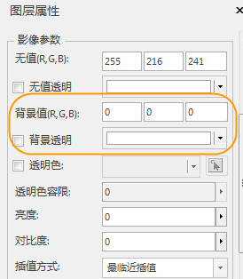  
---  
图：特殊值显示效果设置  
  * **颜色表显示** :镶嵌数据集管理的是DEM数据，可以使用颜色表显示高程分级情况，直观并且美观。
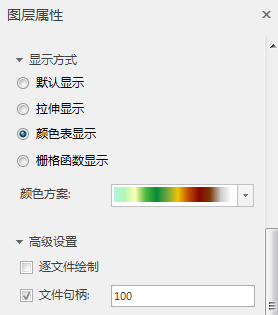  
---  
图：颜色表显示  
  * **影像拉伸显示** :通过拉伸显示，使影像显示更加清晰，并且拉伸和颜色表可以叠加使用。
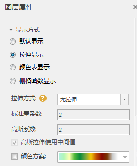  
---  
图：拉伸显示  
  * **栅格函数显示** :镶嵌数据集管理DEM数据时，尤其是大规模数据，可以通过栅格函数快速获得三维晕渲图和正射影像图显示效果。
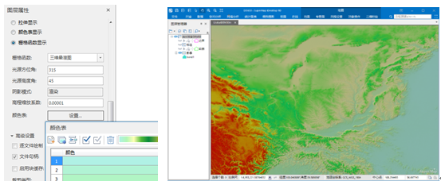  
---  
图：应用三维晕渲图栅格函数  

###  显示范围设置

  * 通过影像图层显示过滤条件设置，可以过滤显示镶嵌影像中的部分影像，显示过滤条件使用轮廓子数据集的属性字段构建。
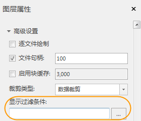  
---  
图：影像图层显示过滤条件设置  
  * 通过镶嵌数据集可以快速配置全国乃至全球的影像地图，然而，有时我们又需要展示局部范围的影像，例如，使影像地图仅显示河北省范围内的影像，此时，就可以使用镶嵌数据集的边界子数据集快速实现。
  * 边界数据集控制镶嵌数据集的显示范围，默认基于轮廓构建。这里，我们可以基于河北省行政区划面数据集重建边界，也可以通过其他方式设置重建范围，如绘制任意多边形或者选择地图中的面对象。边界重建后，边界将更新为河北省的行政边界。
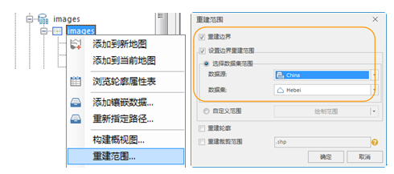  
---  
图：重建边界  
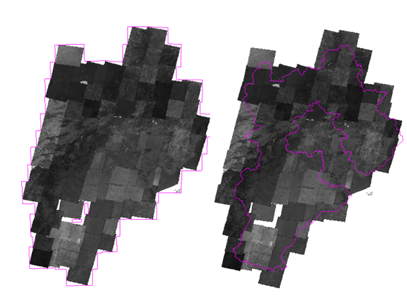  
---  
图：基于面对象重建边界前后  
  * 您还需要在影像图层属性面板进行如下图所示的设置，将裁剪类型设置为“边界裁剪”，即可裁剪显示河北境内的影像。
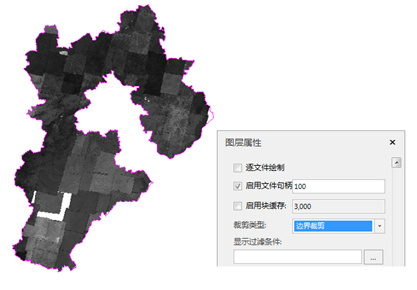  
---  
图：基于面对象重建边界前后  

###  显示性能优化

提升镶嵌数据集拼接影像的显示效率，最基本的处理办法就是创建影像金字塔，镶嵌数据集可以批量对所管理的影像创建金字塔，有关创建金字塔的详细描述请参见[镶嵌数据集管理](MosaicDatasetManage.htm#4)页面。

除了建立影像金字塔，对影像数据采用分块存储后，还可以进一步提升影像显示效率。在“数据处理”区域，选择“影像存储转换”，打开“影像数据转换为块存储”对话框，添加要转换的影像文件、输出的影像文件类型和路径，还可以指定进程数，使用多进程进行转换。有关影像数据转换为块存储的详细描述请参看[影像数据转换为块存储](ImageStorageConversion.htm)。

### 相关主题

 [镶嵌数据集概述](MosaicDataset.htm)

 [管理镶嵌数据集](MosaicDataManagement.htm)

 [创建镶嵌数据集](CreateMosaicDataset.htm)

  

