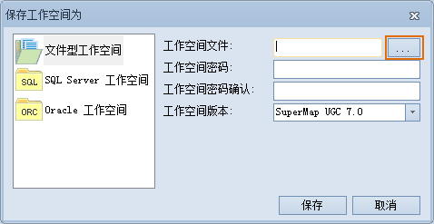

### 使用说明

“保存”按钮提供保存/另存当前打开的工作空间中的操作结果以及保存工作空间的功能，工作空间中的操作结果只有先保存到工作空间中，然后，在进行工作空间本身的保存，这些操作成果才能最终保存下来，在关闭工作空间后，当再次打开工作空间时，才能获取上一次工作的环境以及操作成果。

### 操作步骤

  1. 单击“保存”按钮，只有工作空间中有未保存的内容，该按钮才可用。
  2. 弹出“保存”对话框，提示用户当前工作空间中有哪些未保存的内容，包括：未保存的地图、三维场景、布局。 
    * 对话框中的列表为未保存的项目，每个项目前有一个复选框，默认为选中状态，当复选框被选中时，表示将该项内容保存到工作空间中；否则，不进行保存。
    * “重命名”按钮用来重新指定选中项的名称，即可以改变选中地图、布局或三维场景的名称。
    * “全选”和“反选”按钮，用来全部选中和反选选中列表中未保存的项目。
    * 保存场景中的 KML 图层文件：该复选框用于设置在保存工作空间时，是否保存同时保存场景中存在的 KML 图层文件。若勾选该复选框，则在保存工作空间的同时，也同时保存 KML 图层文件；若不勾选该复选框，则不同时保存 KML 图层文件。
  3. 指定好要保存到工作空间中的内容后，单击对话框中的“保存”按钮，保存指定的内容到工作空间中并关闭对话框。
  4. 如果当前打开的工作空间是已经存在的工作空间，则在上一步中单击“保存”按钮后，即可实现工作空间的保存；如果当前打开的工作空间是一个新的工作空间（非已有的工作空间），则在上一步单击“保存”按钮后，将弹出如下所示的“工作空间另存”对话框，通过“工作空间另存”对话框可以将工作空间保存为你所需要的类型的工作空间；
  5. 单击对话框中左侧的项目，对话框右侧将显示保存相应类型的工作空间所需参数的设置项。

文件型工作空间

  1. 单击“保存”按钮或下拉按钮，选择下拉菜单中“另存文件型...”，将当前打开的工作空间保存或另存为一个新的文件型工作空间。
  2. 在“保存工作空间为”对话框的左侧选择“文件型工作空间”项，对话框的右侧会出现保存文件型工作空间时的用户输入界面，用户需要输入一些必要的信息。
  
---  
图：“保存工作空间为”对话框  
    * **工作空间文件：** 单击右侧的  按钮，在弹出的“保存工作空间为”对话框中指定工作空间文件保存的路径，输入工作空间文件的文件名并指定工作空间文件的保存类型（*.sxwu 或者 *.smwu）。

在将工作空间另存为文件型工作空间时，只能将工作空间另存为 *.sxwu 或者 *.smwu 格式的文件。

    * **工作空间密码：** 为工作空间设置密码进行加密。
    * **工作空间密码确认：** 对输入的密码进行确认。
  3. 信息输入完毕后单击“保存”按钮即可将工作空间保存。

Oracle 工作空间

  1. 单击“保存”按钮或下拉按钮，选择下拉菜单中“另存Oracle...”，将当前打开的工作空间保存或另存为一个新的 Oracle 工作空间。
  2. 在“保存工作空间为”对话框的左侧选择“Oracle 工作空间”项，对话框的右侧会出现保存 Oracle 工作空间时的用户输入界面，用户需要输入一些必要的信息： 
    * **实例名称：** 输入 Oracle 客户端配置连接名。“实例名称”右侧的组合框的下拉列表中将会列出曾经访问过的连接名称，用户可以选择其中的连接名。
    * **数据库名称：** 输入工作空间将要保存到的 Oracle 数据库的名称。
    * **用户名称：** 输入进入指定 Oracle 数据库的用户名。
    * **用户密码：** 输入进入指定 Oracle 数据库的密码。
    * **工作空间名称：** 输入新的工作空间的名称。如果正确输入了实例名称、数据库名称、用户名称、用户密码后，“工作空间名称”右侧的组合框的下拉列表中会列出当前数据库中所包含的所有工作空间的名称。
  3. 信息输入完毕后单击“保存”按钮即可将工作空间保存到指定的 Oracle 数据库中。

SQL Server工作空间

  1. 单击“保存”按钮或下拉按钮，选择下拉菜单中“另存SQL Server...”，将当前打开的工作空间保存或另存为一个新的 SQL Server 工作空间。
  2. 在“保存工作空间为”对话框的左侧选择“SQL Server工作空间”项，对话框的右侧会出现保存SQL Server工作空间时的用户输入界面，用户需要输入一些必要的信息： 
    * **服务器名称：** 输入 SQL Server 数据库服务器名称。“服务器名称”右侧的组合框的下拉列表中将会列出曾经访问过的服务器名称，用户可以选择其中的服务器名。
    * **数据库名称：** 输入工作空间将要保存到的 SQL Server 数据库的名称。
    * **用户名称：** 输入进入指定 SQL Server 数据库的用户名。
    * **用户密码：** 输入进入指定 SQL Server 数据库的密码。
    * **工作空间名称：** 输入新的工作空间的名称。如果正确输入了服务器名称、数据库名称、用户名称、用户密码后，“工作空间名称”右侧的组合框的下拉列表中会列出当前数据库中所包含的所有工作空间的名称。
  3. 信息输入完毕后单击“保存”按钮即可将工作空间保存到指定的 SQL Server 数据库中。

