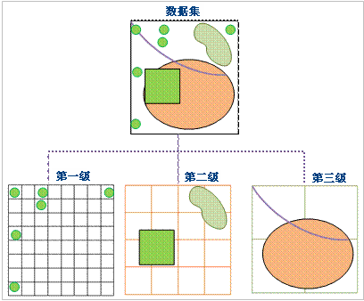

### 原理

采用划分多层网格的方式来组织管理数据。动态索引的基本方法是将数据集按照一定的规则划分成相等或不相等的网格，记录每一个地理对象所占的网格位置。在GIS中常用的是规则网格。当用户进行空间查询时，首先计算出用户查询对象所在的网格，通过该网格快速查询所选地理对象。可以优化查询操作。如图所示:

  

当前版本中，定义网格的索引为一级，二级和三级。每一级都有各自的划分规则，第一级的网格最小，50%以上的数据都会落在第一级网格里，第二级和第三级的网格要相应得比前一级大。

### 特点

* 当数据集在进行浏览操作的时候，动态索引方式的速度会比较快；
* 索引更新和并发的能力好；
* 索引的空间检索准确度高。

**注意** ：此索引类型支持数据集的动态并发编辑，支持数据库型数据源。

### 适用情况

动态索引是SuperMap在5.3中提供的新类型的索引，它结合了R
树索引与四叉树索引的优点，提供非常好的并发编辑支持，具有很好的普适性，为当前版本及以后版本中建立空间索引的默认类型。

若不能确定数据适用于哪种空间索引，推荐建立动态索引。

###  备注

* 支持建立动态索引的引擎类型包括：SQLPlus 和 OraclePlus。
* 建立动态索引后，用户可以按图幅进行本地缓存，可以大大提高查询和浏览的速度，对于GB级数据的影响尤其明显。对于分图幅存储的数据，如国家基本比例尺地形图，可以按照图幅大小建立动态索引。

