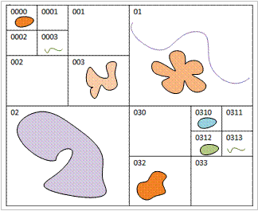
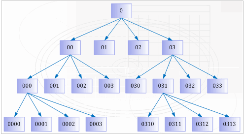

### 原理

四叉树是一种有效的二维空间索引，其基本思路是：把整个工作空间编码为0，用水平线和垂直线划分为将工作空间相等的四部分，各每一部分按顺序分别编码为00、01、02和03，左上角为00，右下角为03；对划分后的格子按照同样的方式继续划分，比如对第00格继续划分，划分后的四个小格子分别编码为000、001、002和003。根据需要，还可以继续划分，比如第031格子继续划分为0310、0311、0312和0313，如下图所示。以此类推，可以一直划分下去，划分的层数取决于研究区域对象的数量和平均大小。

  
---  
图：四叉树分格  
  
假设上图所示的对象为整个数据集包含的空间对象，则据此建立的四叉树结构如下图所示：

  
---  
图：四叉树索引  
  
### 适用情况

四叉树索引适用于小数据量的高并发编辑。

###  备注

支持建立四叉树索引的引擎类型包括：SQLPlus、OraclePlus、KingBase、MySQL、DB2。

* * *

  
  
---

