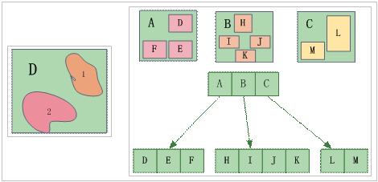

### 原理

R树是基于磁盘的索引结构，是B树(一维)在高维空间的自然扩展，易于与现有数据库系统集成，能够支持各种类型的空间查询处理操作，在实践中得到了广泛的应用，是目前最流行的空间索引方法之一。

R树空间索引方法是通过设计虚拟的矩形目标，将一些空间位置相近的目标对象，包含在这个矩形内，如下左图所示，把这些矩形作为空间索引，它含有所包含的空间对象的指针。例如，A中包含空间对象D、E、F，B中包含空间对象H、I、J、K，C中包含空间对象L、M。如下右图所示为R树索引的例子。

  

在进行空间检索的时候，首先判断哪些矩形落在检索窗口内，再进一步判断哪些目标是被检索的内容。这样可以提高检索速度。

### 特点

* R树索引的空间检索效率非常高，检索精度也很高。
* R树索引的索引数据和地理数据不存储在一起，且R树索引的更新涉及到R树的平衡和分裂，比较复杂，更新速度较慢，大规模编辑后的查询效率降低，需要重建空间索引，适用于只读数据或者不经常进行空间数据编辑的数据。
* R树索引支持文件型数据源和数据库型数据源，具体类型见本页表一。

### 适用情况

R树索引比较适合静态数据，例如用作底图的数据和不经常编辑的数据（属性数据的编辑除外）推荐建立R树索引。

###  备注

支持建立R树索引的引擎类型包括：UDB、SQLPlus、PostgreSQL、OraclePlus、OracleSpatial、KingBase、MySQL、BeyonDB、Altibase。
