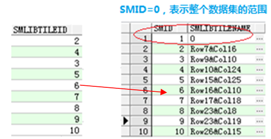
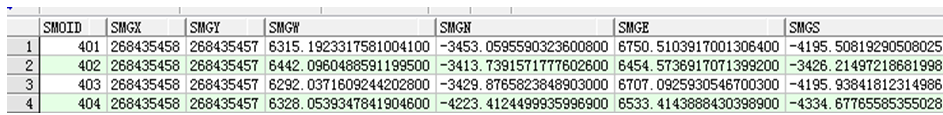

以下示例均以Oracle数据源为例，按照索引类型介绍空间索引的维护方式以及索引的存储情况，方便高级用户深入了解索引在数据库中的结构。

### 四叉树索引

**适用范围：** 适用于小数据量的高并发编辑。

**维护方式：** 没有对应的索引表，如果建此索引，只修改数据集属性表的SmKey值。

**索引存储示例：**

  
---  

### R 树索引

**适用范围：** 比较适合静态数据，例如用作底图的数据和不经常编辑的数据（属性数据的编辑除外）推荐建立 R 树索引。

**维护方式：**

* 对应的索引表名：sm_idx_数据集表名，用来存储R树索引的数据。
* 创建完索引，在没有修改数据集几何对象时，数据集属性表的SmKey=-2。
* 注册表smregister中的SmIndexLevel=0。
* 如果添加或修改记录，则此记录的SmKey可能大于-2（由于R树索引算法决定）。
* 如果有记录的SmKey大于-2，则注册表smregister中的SmIndexLevel=5。

**索引存储示例：**

  
---  

### 图库索引

**适用范围：**

* 字段索引：即根据数据集的某一属性字段将空间对象进行分类，通过索引进行管理已分类的空间对象，以此提高查询检索速度。
* 范围索引：即根据给定的一个范围（图幅的长和宽）将空间对象进行分类，通过索引进行管理已分类的空间对象，以此提高查询检索速度。

**维护方式：**

* 对应的索引表名：Lib_数据集表名。
* 数据集属性表中的SmLibTileID值对应索引表中的SmID。
* SMLIBTILENAME字段记录数据所在的行列号（行列号的（0,0）值从数据集范围的左下角开始计算）。
* 数据集表中的SmLibTileID字段和索引表中的SMID字段是一对多的关系。
* 数据查询的过程：第一步，根据获取当前地图窗口的范围；第二步，根据范围和图库索引分幅时每个图幅的大小，判断在当前视图中都有哪些图幅需要显示；第三步，在对应的索引表（Lib_数据集表名）中找到与这些图幅对应的SMID值；第四步，通过这个SMID值与数据集表的SmLibTileID字段的关联关系，找到所需要显示的对象。通过以上四步，就可以快速定位到所需显示的对象。
* 对于新增加的对象，同时，该对象在原数据集范围外，这时，会将该对象添加到索引表的SMID=1中。

**索引存储示例：**

  
---  

### 动态索引

**适用范围：** 结合了 R 树索引与四叉树索引的优点，提供非常好的并发编辑支持，具有很好的普适性。

**维护方式：**

* 对应的索引表名：SM_GDX_数据集ID。
* SmDynamicIndex表记录着各数据集的动态索引信息。

**索引存储示例：**

  
---  

### 备注

在数据进行了增删的修改后，索引会进行自动的维护，但在此处为了不影响显示的效率，维护并不会对索引进行重建，因此，在进行了大量的增删操作后，建议手动重建索引，以达到索引更新维护，保证数据的显示查询效率。

