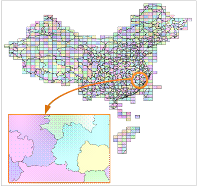

### 原理

在 SuperMap SDX +
中根据数据集的某一属性字段或根据给定的一个范围（图幅的长和宽），将空间对象进行分类，通过索引进行管理已分类的空间对象，以此提高查询检索速度。如下图所示为中国市级行政边界图的分幅合成地图，根据给定范围创建图库索引后，显示h4708的场景。图库索引在海量数据（即对象数超过百万个的数据）的显示和查询时优势尤其明显。建立图库索引后，在显示的时候，只显示你需要查看的那一幅或几幅地图，大大缩短显示时间。图为图库索引示意图：  

  
---  

特别地，图库索引还可以被缓存到本地（以二进制文件形式体现），这样可更进一步提高查询检索的速度。文件缓存是 SuperMap SDX+
为均衡网络和服务器负载、提高应用整体性能而提供的智能分布式存储方案。开启文件缓存选项后，应用程序在访问存储在空间数据库中的数据时，会首先检查本地缓存库中是否已经有相应数据的最新版本，如果没有相应的缓存数据或是缓存数据不是最新版本，则从服务器端读取数据并更新本地缓存数据，这样下次访问的时候就可以直接读取本地缓存数据；如果本地缓存中已经有了相应数据的最新版本，则不必通过网络向服务器请求数据，而是直接读取本地缓存数据来完成显示或分析的功能。通过这种解决方案，可以大幅降低数据库服务器负载和网络负载，从而大幅提高应用程序的整体性能。

### 适用情况

对于按标准比例尺分幅存储(如1:25万数据、1:10万数据、1:5万数据等)的数据合并到数据库中后生成的数据集，图库索引有着优异的效果，可以提供非常好的查询性能，与
SuperMap 提供的缓存选项搭配使用可以达到更好的地图浏览速度。

###  备注

* 建立图库索引的算法在5.3中做了大幅改进，根据数据量大小不同，建立索引耗时可减少4-10倍，对于记录数较多(大于5万)的数据集要建图库索引的话建议使用5.3及以后的版本来建立。
* 图库索引目前仅支持的是数据库型数据源中的点、线、面、文本和 CAD 数据集。
* 支持建立图库索引的引擎类型包括：SQLPlus、OraclePlus、KingBase、MySQL。