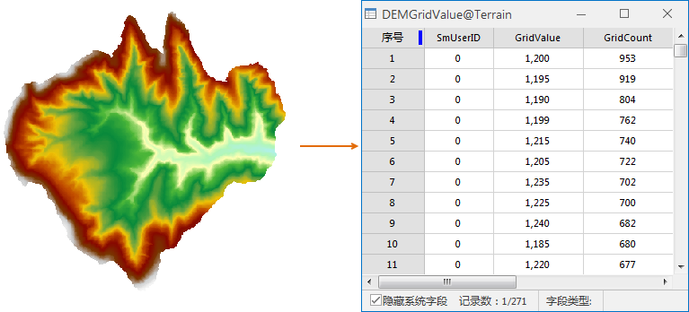

### 使用说明

“统计栅格值”命令，用于统计栅格数据集的栅格值。便于用户查看栅格值的具体单值分布情况。

注意：此命令只对栅格数据集（即 Grid 数据）有效，对于影像数据集（如 Image
格式的栅格数据），不能进行统计栅格值，因此，这类数据集的右键菜单中没有“统计栅格值”的选项。

该功能与栅格直方图类似，都是统计栅格数据集的栅格值，不同在于栅格直方图的统计结果是以栅格区间的形式，展示某一个字段分组后的频率分布图和数据，而统计栅格值统计的是栅格数据集中具体栅格值得单值个数。

### 操作步骤

1. 右键点击选中工作空间管理器中的一个需要统计栅格值的栅格数据集结点（或选中多个数据集结点后，单击鼠标右键），在弹出右键菜单中选择“统计栅格值”命令，系统将对选中的栅格数据集进行栅格值统计。
2. 统计成功，将自动弹出统计结果，结果数据为属性表，属性表中记录统计出的栅格值及其单值数量，如下图所示。
  
