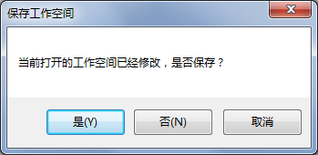
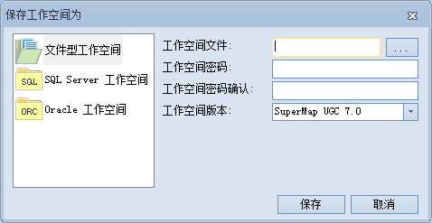

### 使用说明

“关闭工作空间”，主要提供关闭当前打开的工作空间的功能。关闭工作空间后，应用程序会提供一个默认打开的空的工作空间作为当前打开的工作空间。

### 操作步骤

  1. 在工作空间节点上右击鼠标，在弹出的右键菜单中选择“关闭工作空间”项。
  2. 应用程序在执行当前打开的关闭工作空间操作时，如果应用程序中当前打开的工作空间没有未被保存的内容，则直接关闭当前的工作空间；如果当前打开的工作空间存在未被保存的内容，则会弹出对话框（如下图所示），提示用户在关闭当前打开的工作空间时是否保存这些内容。
  
---  
图：提示保存工作空间对话框  
  
如果点击“否”按钮，则不进行保存直接关闭当前打开的工作空间；如果点击“是”按钮，则对当前打开的工作空间进行保存工作，此时保存分为两种情况：

    * 如果当前打开的工作空间是已经存在的工作空间，则点击对话框中的“是”按钮后直接将未保存的内容保存到该工作空间中，然后关闭该工作空间。
    * 如果当前打开的工作空间是一个新的工作空间（非已有的工作空间），则点击对话框中的“是”按钮后，将会弹出“工作空间另存”对话框，待到完成工作空间的保存操作后，才会关闭该工作空间。
  
---  
图：“保存工作空间为”对话框  

###  相关主题

[保存工作空间](SaveWorkspace.htm)

