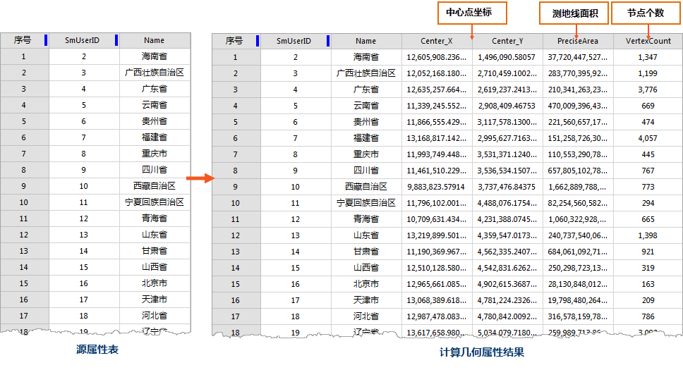

支持“计算几何属性”和“更新几何属性”功能，将矢量对象的空间或几何特性计算结果添加（更新）至属性表中，例如长度、面积中心点等。

### 计算几何属性

计算几何属性，是将矢量对象的空间或几何属性信息添加为新的属性字段，例如中心点坐标、子对象个数、测地线周长等，以上属性信息为对象自身的元数据属性，当用户需要利用其属性信息进行操作与处理时，不需要借助其他工具，通过计算几何属性功能既能将其添加为新的属性字段，提高了地理空间数据属性处理的工作效率。
**注意** ：此操作会修改源数据。用户若不想修改源数据，请在操作之前进行数据的备份工作。

它会向当前属性表添加一个或多个属性字段，具体视几何属性参数中指定的选项而定。

**功能入口**

打开矢量数据集属性表， 单击 **属性表** -> **编辑** 组-> **计算几何属性** 按钮，弹出 **计算几何属性** 对话框。

**参数说明**

  * **几何属性** ：根据选择的矢量数据集类型不同，几何属性略有不同。
    * **中心点坐标** ：添加对象的中心点 x 坐标、y 坐标，选择此项属性表中添加 Center_X，Center_Y 两个字段。
    * **质心坐标** ：添加对象的质心点 x 坐标、 y 坐标，选择此项属性表中添加 Inner_X，Inner_Y 两个字段。
    * **测地线面积** ：添加面对象的测地线面积，选择此项属性表中添加 PreciseArea 字段。
    * **测地线周长** ：添加面对象的测地线周长或线对象的测地线长度，选择此项属性表中添加 PrecisePerimeter 字段。
    * **子对象个数** ：添加对象所包含的子对象个数，选择此项属性表中添加 PartCount 字段。
    * **节点个数** ：添加线对象/面对象的节点个数，选择此项属性表中添加 VertexCount 字段。
    * **范围坐标** ：添加对象的范围坐标，选择此项属性表中添加 Left_User、Right_User、Top_User、Bottom_User 四个字段。
    * **线起点** ：添加线对象起点 x 坐标和 y 坐标，选择此项属性表中添加 Start_X、Start_Y 两个字段值。
    * **线中点** ：添加线对象中点 x 坐标和 y 坐标，选择此项属性表中添加 Middle_X、Middle_Y 两个字段值。
    * **线终点** ：添加线对象终点 x 坐标和 y 坐标，选择此项属性表中添加 End_X、End_Y 两个字段值。
  * **长度单位/面积单位** ：用以计算长度和面积的单位，若已指定了坐标则长度和面积将以该坐标系的单位以该坐标系的单位进行计算。
  * **坐标系** ：用于计算坐标、长度和面积的坐标系，默认使用当前数据集的坐标系。

**应用实例** ：

如下左图为中国省界面数据集属性表，分别计算中心点坐标、测地线面积以及节点个数三个几何属性，得到如下右图的结果。

  
---  
  
### 更新几何属性

更新几何属性，是将矢量对象的空间或几何属性信息更新至属性表中，例如中心点坐标、子对象个数、测地线周长等。当属性信息发生变更或需要将某一属性信息更新为特性的几何属性信息时，通过更新几何属性功能，既能快速完成更新属性信息的操作。
**注意** ：此操作会修改源数据。用户若不想修改源数据，请在操作之前进行数据的备份工作。

它会将选择的几何属性更新至待更新字段，具体视几何属性参数中指定的几何属性选项而定。

**功能入口**

打开矢量数据集属性表，单击 **属性表** -> **编辑** 组-> **计算几何属性** 按钮，在“计算几何属性”对话框的选择模式中选择
**更新几何属性** 。

在 **待更新字段** 列表中，选择待更新的属性字段。 其他参数设置同“计算几何属性”功能中的参数描述。

**应用实例** ：

将源数据中SmUserID 属性信息更新为测地线周长的属性信息，得到如下图的结果。

  
---  
  

