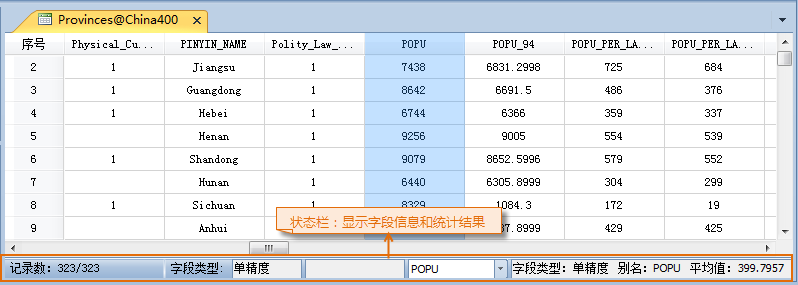

### 使用说明

“平均值”按钮，用来统计属性表中选中的数值型字段的属性值的平均值。

### 操作步骤

  1. 获取属性表：在工作空间管理器中，右键点击某个矢量数据集，在弹出的右键菜单中选择“浏览属性表”。
  2. 在打开的属性表中，点击要统计的字段的字段名称来选中该列，并且所选择的字段必须为数值型字段。
  3. 单击“平均值”按钮。
  4. 在属性表窗口底部的状态栏中显示出选中列的字段类型、别名以及所有属性值的平均值。

“平均值”按钮可以同时对属性表中多个选中列的属性值分别进行平均值统计，若在属性表中同时选中了多列，点击“平均值”按钮后，系统会在状态栏中默认显示出选中字段中最靠前
（即所有选中属性列的最左边）的字段的字段类型、别名以及所有属性值的平均值。用户可以通过状态栏中间的组合框的下拉列表，选择其它已选中的字段，查看其相关属性以及平均值计算结果。

  
---  

###  注意事项

  1. 只有当属性表窗口中有可视的选中列，“平均值”按钮才可用。
  2. 若属性表中选中的列为非数值型字段，点击“平均值”按钮后，在状态栏中最右侧的区域会显示提示信息，提示“选中字段为非数值类型，不符合统计要求”。

 [总和](SumButton.htm)

 [最大值](MaxButton.htm)

 [最小值](MinButton.htm)

 [方差](VarianceButton.htm)

 [标准差](StdDeviationButton.htm)

 [单值个数](CountOfValueButton.htm)

