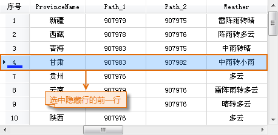
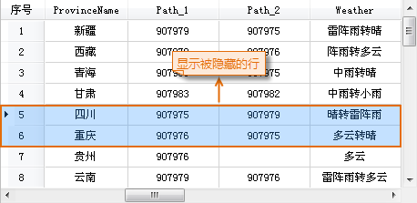

### 使用说明

“取消行隐藏”按钮，用来显示属性表中被隐藏的行。

### 操作步骤

  1. 在有隐藏行的属性表中，根据隐藏行标志的位置（隐藏行标志的相关内容参见[“隐藏行”按钮](HiddenRows.htm)）：
  * 用户可选择隐藏行的前一行，单击“取消行隐藏”按钮，显示被选择行后的所有被隐藏行。
  * 也可以选择隐藏列的前一行和后一行，单击“取消行隐藏”按钮后，显示被选择的两个行之间的被隐藏行。
  * 若当前属性表中无可选择的行，则说明所有的行都被隐藏，则单击“取消行隐藏”按钮后，显示所有隐藏行。
  2. 隐藏行标志对应的隐藏行显示后，隐藏标志消失。
|   

### 注意事项

  1. 只有在当前属性表中有选中的行时，“取消行隐藏”按钮才可用。
  2. 关于如何隐藏属性行的具体操作，请参考[“隐藏行”按钮](HiddenRows.htm)页面。

 [升序](SortOrderAscendingButton.htm)

 [降序](SortOrderDescendingButton.htm)

 [隐藏列](HideButton.htm)

 [取消列隐藏](CancelHideButton.htm)

 [隐藏行](HiddenRows.htm)

 [筛选](FilterButton.htm)

 [定位](GoToButton.htm)

 [显示十六进制](DisplayHexadecimal.htm)

