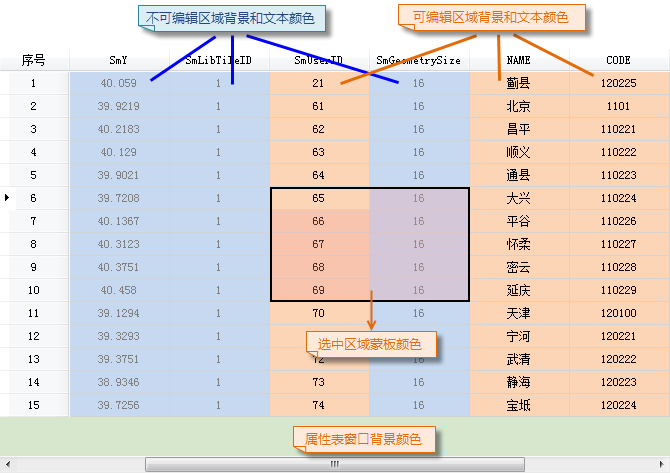

### 使用说明

属性表的“颜色设置”功能，可设置属性表可编辑区域、不可编辑区域、窗口区域等背景色，同时支持设置文本颜色和选中区域蒙板颜色。

### 操作步骤

  1. 获取属性表：在工作空间管理器中，右键点击某个矢量数据集，在弹出的右键菜单中选择“浏览属性表”；若数据集为纯属性表数据集，可通过双击打开属性表。
  2. 在“ **属性表** ”选项卡的“ **设置** ”组中，单击“颜色设置”按钮，弹出“颜色设置”对话框，如下图所示。
  

  3. 设置背景颜色或文本颜色时，单击组合框右侧下拉按钮，在弹出的颜色板中选择需要的颜色即可。其中，选中区域支持设置蒙板颜色透明度，可直接在文本框中输入数值，或单击右侧下拉按钮通过移动滑动条进行设置。
  4. 完成设置后，单击对话框中的“确定”按钮，即可将颜色设置应用到所有属性表中。若需将属性表颜色恢复默认设置，单击对话框中的“默认”按钮即可。属性表颜色设置结果如下图所示：  
  
  

### 注意事项

  1. 属性表颜色设置为全局设置，该设置对程序所有的属性表窗口都生效。

  

