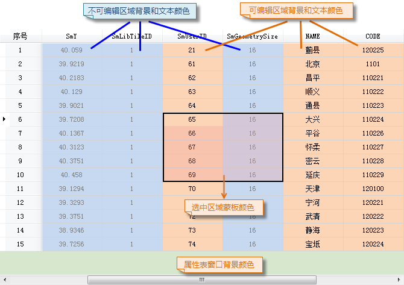

支持对属性表进行隐藏系统字段、列宽设置及颜色设置。(iDesktopX仅支持系统字段)

### 隐藏系统字段

“隐藏系统字段”选项，用来隐藏属性表中的系统字段。

**功能入口**

* 在“ **属性表** ”选项卡的“ **设置** ”组中，单击“隐藏系统字段”按钮。
* 勾选属性表左下角“隐藏系统字段”复选框隐藏当前属性表的系统字段。

### 属性表列宽设置

“列宽设置”选项，用来设置属性表的列宽度。

**功能入口**

在“ **属性表** ”选项卡的“ **设置**
”组中，单击“列宽设置”按钮，弹出“列宽设置”对话框，如下图所示。若只需要修改某一列或某几列的列宽，可先选中需设置列宽的整列或列中的任意单元格，可配合使用
Ctrl 或 Shift 键进行选择，在单击“列宽设置”按钮。

**参数说明**

列宽设置方式有三种，分别为：最合适列宽、标准列宽、自定义列宽，具体说明如下：

* **最合适列宽** ：选中“最合适列宽”单选框，表示属性表列宽将根据单元格内容和字段名称长度自动调整列宽。
* **标准列宽** ：选中“标准列宽”单选框，表示属性表列宽将设置为标准列宽，SuperMap 设定的标准列宽为：100 个像素。
* **自定义列宽** ：选中“自定义列宽”单选框，可在右侧文本框中输入列宽像素个数。列宽的值域为[2，+∞)，像素单位一般为整数，则输入的列宽需为整数。

若勾选了“仅修改选中列”复选框，则表示设置的列宽只对选中列或选中单元格所在列生效；若未勾选改复选框，则表示设置的列宽对属性表中所有列都生效。

### 颜色设置

属性表的“颜色设置”功能，可设置属性表可编辑区域、不可编辑区域、窗口区域等背景色，同时支持设置文本颜色和选中区域蒙板颜色。

**功能入口**

在“ **属性表** ”选项卡的“ **设置** ”组中，单击“颜色设置”按钮，弹出“颜色设置”对话框

**参数说明**

在“颜色设置”对话框中设置背景颜色或文本颜色时，单击组合框右侧下拉按钮，在弹出的颜色板中选择需要的颜色即可。其中，选中区域支持设置蒙板颜色透明度，可直接在文本框中输入数值，或单击右侧下拉按钮通过移动滑动条进行设置。

完成设置后，单击对话框中的“确定”按钮，即可将颜色设置应用到所有属性表中。若需将属性表颜色恢复默认设置，单击对话框中的“默认”按钮即可。属性表颜色设置结果如下图所示：

  
---  

### 注意事项

属性表颜色设置为全局设置，该设置对程序所有的属性表窗口都生效。

### 高亮选中对象

“高亮选中对象”用于关联浏览属性表时，选中属性表整列后用来设置是否在关联地图中显示选中的所有对象。当数据量比较大或者在与地图进行关联浏览地图时，选中整列不高亮显示关联对象可提高用户操作效率。

属性表与地图关联之后，选中属性表列头选中整列后，单击鼠标右键，在右键菜单中选择“高亮选中对象”，即可在关联地图中高亮显示所有对象。高亮显示选中的关联对象不适用于数据量较大的数据。
**注意** ：当地图和属性表进行关联浏览时，默认不关联显示整列对象，即单击属性表列头选中整列时，地图窗口的所有对象也不会高亮显示。

