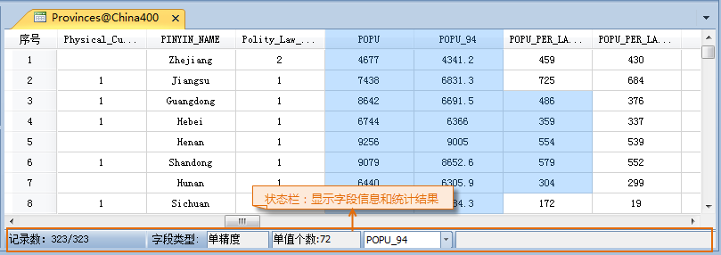

### 使用说明

“单值个数”按钮，用来统计当前属性表窗口中选中的单元格中有值的单值总数。

### 操作步骤

  1. 获取属性表：在工作空间管理器中，右键点击某个矢量数据集，在弹出的右键菜单中选择“浏览属性表”。 
  2. 在打开的属性表中，选中要统计单值个数的单元格或属性列。
  3. 单击“单值个数”按钮。
  4. 在属性表窗口底部的状态栏的左侧的区域会显示出当前选中的所有单元格中，可视的有值单元格的单值总数（数值型和字符型属性值都被统计）。
  

### 注意事项

  1. 只有当属性表窗口中有可视的列，且有选中的单元格，“单值个数”按钮才可用。
  2. “单值个数”按钮统计的是选中的单元格中，可视的有值单元格的单值总数，若单元格已选中但不可视，单元格将不参与单值个数统计。

 [总和](SumButton.htm)

 [平均值](AverageButton.htm)

 [最大值](MaxButton.htm)

 [最小值](MinButton.htm)

 [方差](VarianceButton.htm)

 [标准差](StdDeviationButton.htm)

