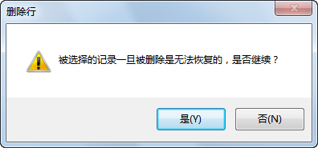

### 使用说明

“删除行”选项，用于删除矢量数据集的属性表或纯属性数据集中选中的一行或多行属性记录。

### 操作步骤

  1. 打开需要进行删除行操作的属性表，可以是矢量数据集属性表，也可以是纯属性数据集，可在工作空间管理器中，右键点击要打开属性表的数据集（矢量数据集或者纯属性数据集），在弹出的右键菜单中选择“浏览属性表”，或双击纯属性表数据集。
  2. 选中矢量数据集的属性表或纯属性数据集中的一行或多行属性记录，或选中要删除行中的单元格。
  3. 单击右键，选择“删除行”选项，弹出“删除行”对话框。   
      
  4. 点击“是”，即可删除选中行或选中的单元格对应行的属性记录。

### 注意事项

  1. 若使用“删除行”按钮删除矢量数据集的属性表中的属性记录，被删除的记录对应的几何对象也会被一并删除，所以“删除行”按钮要慎用。
  2. 只有矢量数据集或纯属性数据集为非只读状态，“删除行”选项才可用，否则该选项会一直显示灰色，即为不可用状态。

###  相关主题

  [属性表复制粘贴](CopyAndPaste.htm)

 [属性表拖拽](DragTabular.htm)

  [添加行](AddRecordsButton.htm)

  [更新列](UpdateButton.htm)

  [撤销/重做](UndoButton.htm)

 [二进制字段编辑](BinaryEdit.htm)

  

