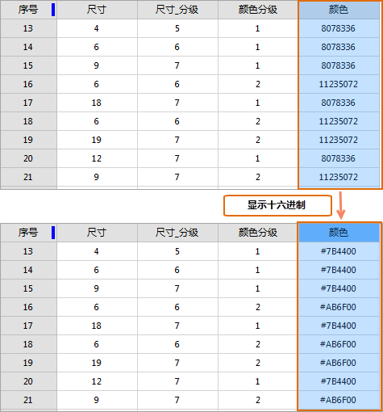

### 使用说明

“显示十六进制”按钮，用来将属性表中选中的 **整型列显示为十六进制**
，可方便用户查看和填写十六进制的数值。适用于用户在编辑自定义专题图颜色值时，在字段属性表中直接填写十六进制颜色值。

只有在当前属性表中有选中的列为整型字段时，“显示十六进制”按钮才可用。

  * 在打开的属性表中，选中需要进行显示操作的列，单击“显示十六进制”按钮，即可将该整型列的值按照十六进制的方式显示。  
  
  
---  
  * 再次单击“显示十六进制”按钮，该列数据恢复为原十进制方式显示。
### 相关主题 
 [降序](SortOrderDescendingButton)

 [隐藏列](HideButton)

 [取消隐藏](CancelHideButton)

 [筛选](FilterButton)

 [定位](GoToButton)

