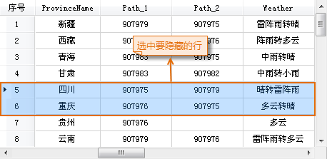
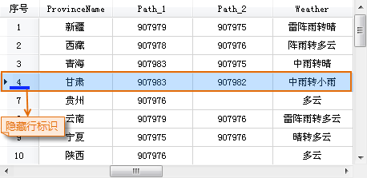

### 使用说明

“隐藏行”功能用来隐藏属性表中选中的行。

### 操作步骤

  1. 打开属性表：在工作空间管理器中，右键点击某个矢量数据集，在弹出的右键菜单中选择“浏览属性表”，或双击纯属性表数据集。
  2. 在打开的属性表中，选中需要隐藏的一个或多个行，可配合使用 Shift 或 Ctrl 键选中多条记录。
  3. 在“属性表”选项卡的“浏览”组中，单击“隐藏行”按钮，或单击鼠标右键，选择“隐藏行”选项。
  4. 选中的行将不再显示在属性表窗口中，同时在被隐藏行的前一行记录会被整行选中，且该行记录下方会显示隐藏行的标志。  
  
|   
  

###  注意事项

  1. 只有在当前属性表中有选中的行时，“隐藏行”按钮才可用。
  2. 隐藏行操作并不会删除被隐藏的属性行，只是让某些行暂时不可视，可以使用[“取消行隐藏”按钮](CancelHideRows.htm)显示隐藏的属性行。
  3. 关闭属性表后再次打开，将不会保留前一次的隐藏行或隐藏列操作，会显示属性表中所有的行、列信息。

 [升序](SortOrderAscendingButton.htm)

 [降序](SortOrderDescendingButton.htm)

 [隐藏列](HideButton.htm)

 [取消列隐藏](CancelHideButton.htm)

 [取消行隐藏](CancelHideRows.htm)

 [筛选](FilterButton.htm)

 [定位](GoToButton.htm)

 [显示十六进制](DisplayHexadecimal.htm)

