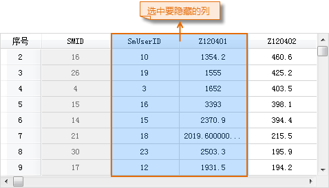
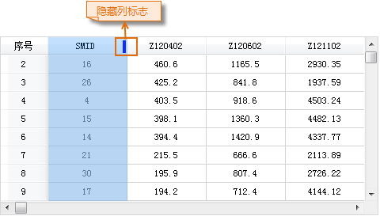
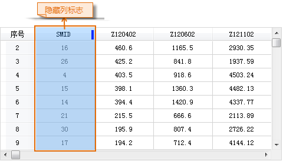

### 隐藏列

“隐藏列”选项，用来隐藏属性表中选中的列。

**操作步骤**

  1. 在打开的属性表中，选中需要隐藏的一个或多个列，通过点击相应的字段名称，或配合使用 Shift 或 Ctrl 键点击多个字段名称，即可选中相应字段的整列数据。
  2. 单击 **属性表** 选项卡-> **浏览** -> **隐藏列** 选项，或单击右键选择“ **隐藏列** ”选项。
  3. 选中的列将不再显示在属性表窗口中，同时在被隐藏列的左侧第一列的字段被整列选中，且该列字段名称右侧出现隐藏列的标志。  

|   
---|---  

**注意事项**

  * 只有在当前属性表中有选中的行时，“隐藏列”按钮才可用。
  * 隐藏列操作并不会删除被隐藏的属性列，只是让某些列暂时不可视，可以使用“取消隐藏”选项显示隐藏的属性列。
  * 关闭属性表后再次打开，将不会保留前一次的隐藏行或隐藏列操作，会显示属性表中所有的行、列信息。

### 取消列隐藏

“取消列隐藏”选项，用来显示属性表中被隐藏的所有列。只有在当前属性表中有选中的列时，“取消列隐藏”按钮才可用。

**功能入口**

  * 打开有隐藏列的属性表，单击 **属性表** 选项卡-> **浏览** -> **取消列隐藏** 按钮，即可显示所有隐藏列。 
  * 在属性表中单击右键，选择“ **取消列隐藏** ”选项，即可显示所有隐藏列。

若当前属性表中无可选择的列，则说明所有属性列都被隐藏，则单击“取消列隐藏”按钮后，显示所有隐藏列。

隐藏列标志对应的隐藏列显示后，隐藏标志消失。

|   
---|---  
  
 [升序](SortOrderAscendingButton.html)

 [降序](SortOrderDescendingButton.html)

 [取消列隐藏](CancelHideButton.html)

 [隐藏行](HiddenRows.html)

 [取消行隐藏](CancelHideRows.html)

 [筛选](FilterButton.html)

 [定位](GoToButton.html)

 [显示十六进制](DisplayHexadecimal.html)

