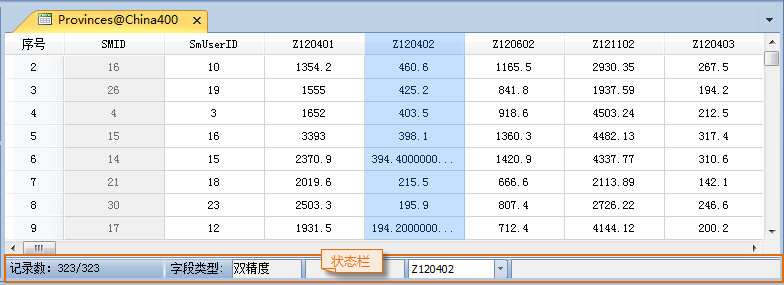

### 使用说明

“降序”按钮，用来对属性表中的记录按照选中的列的值进行降序排序。

### 操作步骤

  1. 获取属性表：在工作空间管理器中，右键点击某个矢量数据集，在弹出的右键菜单中选择“浏览属性表”，或双击纯属性表数据集。
  2. 在打开的属性表中，单击降序排列的属性列的字段名称来整列选中该列，单击“降序”按钮，即可按所选字段中的值的降序序列排列属性表中的记录。

若同时选中了多个属性列（配置 Ctrl 或 Shift
键），系统默认会按照所选中字段中最靠前（即所有选中属性列的最左边）的字段的属性值进行降序排列，用户也可以通过改变属性表窗口底部的状态栏中间的下拉列表显示的字段名称，浏览选中字段的基本信息。

  

###  注意事项

  1. 只有在当前属性表中有选中的列时，“降序”按钮才可用。
  2. 一旦对属性表进行排序后，无法取消排序操作。

 [升序](SortOrderAscendingButton.htm)

 [隐藏列](HideButton.htm)

 [取消隐藏](CancelHideButton.htm)

 [筛选](FilterButton.htm)

 [定位](GoToButton.htm)

 [显示十六进制](DisplayHexadecimal.htm)

