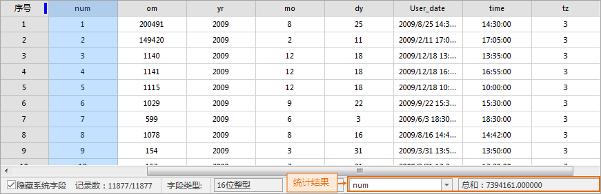

在“ **属性表** ”选项卡的“ **统计分析**
”组和属性表右键菜单中的“统计分析”组中，组织了对矢量数据集的属性表以及纯属性数据集进行统计分析的7种功能，包含：总和、平均值、最大值、最小值、方差、标准差及单值个数。

统计分析类型 | 描述  
---|---  
总和 | 用来统计属性表中选中的数值型字段的属性值的总和。  
平均值 | 用来统计属性表中选中的数值型字段的属性值的平均值。  
最大值 | 用来统计属性表中选中的数值型字段中的最大属性值。  
最小值 | 用来统计属性表中选中的数值型字段中的最小属性值。  
方差 | 用来统计属性表中选中的数值型字段的所有属性值的方差。  
标准差 | 用来统计属性表中选中的数值型字段的所有属性值的标准差。  
单值个数 | 用来统计当前属性表窗口中选中的单元格中有值的单值总数。  
  
  * 只有当属性表窗口中有可视的选中列，统计分析组中的统计功能按钮才可用。
  * 所选择的统计字段必须为数值型字段，统计才有意义。若属性表中选中的列为非数值型字段，统计后，在状态栏中最右侧的区域会显示提示信息，提示“选中字段为非数值类型，不符合统计要求”。

属性表中统计分析功能操作相同，以下以“总和”为例：

**功能入口**

在打开的属性表中，点击要统计的字段的字段名称来选中该列，并且所选择的字段必须为数值型字段。

单击 **属性表** 选项卡-> **统计分析** -> **总和** 选项，或单击右键选择“ **统计分析** -> **总和**
”选项。在属性表窗口底部的状态栏和输出窗口将输出统计结果，结果包含选中列的字段类型、别名以及所有属性值的总和。

  

