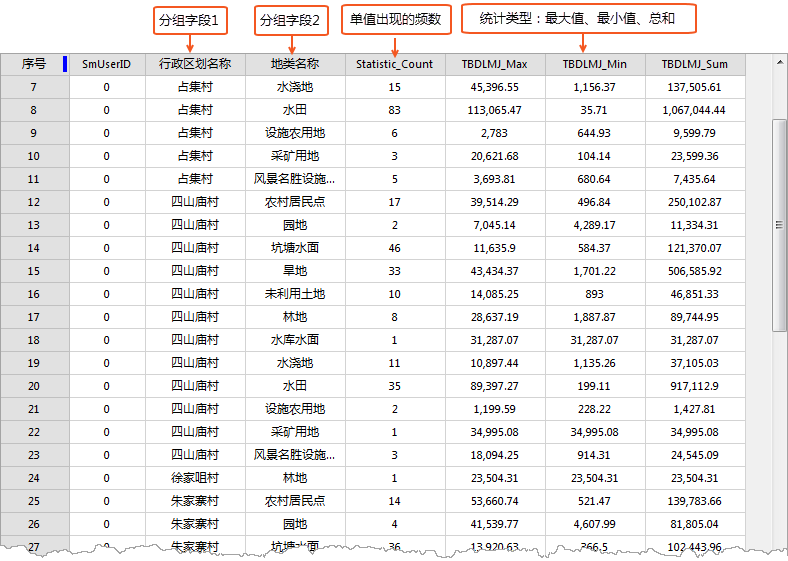

### 使用说明

汇总字段，是为属性表中的字段计算汇总统计数据。汇总统计结果将输出一个新的属性表，表中将由包含统计运算结果的字段及汇总字段中每个单值出现的频数组成。

支持设置多个汇总字段同时进行多类型汇总统计，使统计更加便捷快速，且统计结果为属性表数据，方便用户导出为Excel
等文件形式在其他场景中使用。例如用户在做土地利用数据汇总工作，需要统计各种数据，如坡度、质量等别、耕地、建设用地等，使用统计汇总功能避免用户重复设置统计条件，既能快速的得到统计结果。

**应用实例**

现有某区域的土地利用分类数据，包含“行政区划名称”（XZQHMC）、“地类名称”（DLMC）、“图斑地类面积”(TBDLMJ)等字段。需要统计各行政区划中不同图斑地类的面积情况。以示范数据中
ThemeMap\Land Use\Land Use.udb为例对汇总操作进行详细描述。

### 操作说明

  1. 打开 Land Use.udb 数据源，选中矢量数据集 JSTB，在弹出的右键菜单中选择“浏览属性表”。 
  2. 单击 **属性表** -> **统计分析** 组-> **汇总字段** 按钮；或在属性表中右键，在右键菜单中选择“ **汇总字段...** ”，弹出 **汇总字段** 对话框。
  3. 在 **汇总字段** 对话框中设置如下参数： 
  * **源数据** :通过设置过滤表达式和分组字段，设置参与汇总统计的数据。 
    * **过滤表达式** ：可通过设置过滤表达式，过滤掉不需要参与统计的数据，关于如何使用SQL表达式，请参考[SQL查询](../../Query/SQLQuery.htm)。
    * **分组字段** ：支持设置分组统计。若未指定分组字段，则输出属性表中将仅包含一条记录；若指定一个分组字段，则每个分组字段值均有一条对应的记录；若指定多个分组字段，则二次分组将在前一次分组的基础上再分组。例如此处设置两个分组字段“XZQHMC”（行政区划名称）、“DLMC”（地类名称），程序在统计时会先以“XZQHMC”分组，再在第一次分组的基础上对“DLMC”二次分组。
  * **汇总字段** ：在汇总字段的列表中设置参与汇总的字段及统计类型。 
    * **选择统计字段** ：在字段列表中，每一个字段前面都有一个复选框，勾选复选框，表示该字段参与统计。此处勾选“TBDLMJ”（图斑地类面积）字段的复选框。
    * **统计类型** ：支持以下统计运算：最大值、最小值、总和、平均值、标准差、和方差，支持多选。此处设置统计类型为最大值、最小值、总和。
    * 将使用以下命名约定为每种统计类型创建对应的结果字段：‘field’_Max、‘field’_Min、‘field’_Sum，‘field’_Average、‘field’_StdDeviation, ‘field’_Variance,（其中 ‘field’是计算统计数据的输入字段名称）。
  * **目标数据** :设置存储汇总统计结果输出的数据源及数据集。
  4. 单击 **确定** 按钮，执行字段汇总操作，执行完成将在输出窗口给出结果提示。汇总结果会生成新的属性表数据集，如下图所示。 

**行政区划名称** 和 **地类名称** 为设置的分组字段， **Statistic_Count** 为当前分组字段下统计字段每个单值出现的频数。
**TBDLMJ_Max** 、 **TBDLMJ_Min** 、 **TBDLMJ_Sum** 为统计类型的结果。

  

 [总和](SumButton.htm)

 [平均值](AverageButton.htm)

 [最大值](MaxButton.htm)

 [最小值](MinButton.htm)

 [方差](VarianceButton.htm)

 [标准差](StdDeviationButton.htm)

