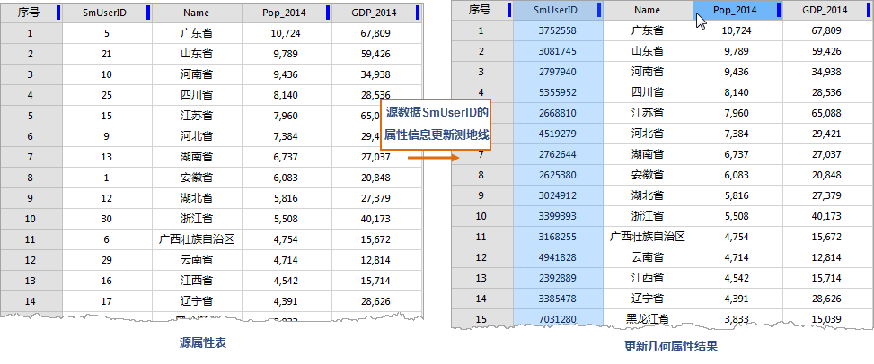

### 使用说明

更新几何属性，是将矢量对象的空间或几何属性信息更新至属性表中，例如中心点坐标、子对象个数、测地线周长等。当属性信息发生变更或需要将某一属性信息更新为特性的几何属性信息时，通过更新几何属性功能，既能快速完成更新属性信息的操作。
**注意** ：此操作会修改源数据。用户若不想修改源数据，请在操作之前进行数据的备份工作。

它会将选择的几何属性更新至待更新字段，具体视几何属性参数中指定的几何属性选项而定。

### 功能入口

选中矢量数据集，在弹出的右键菜单中选择“浏览属性表”。 单击 **属性表** -> **编辑** 组-> **更新几何属性** 按钮，弹出
**更新几何属性** 对话框。

### 参数说明

* **待更新字段** ：选择待更新的属性字段。 
* **几何属性** ：根据选择的矢量数据集类型不同，几何属性略有不同。
  * **中心点坐标_X/中心点坐标_Y** ：将对象的中心点 x 坐标或 y 坐标更新至待更新字段。
  * **质心坐标_X/质心坐标_Y** ：将对象的质心点 x 坐标或 y 坐标。
  * **测地线面积** ：将面对象的测地线面积属性更新至待更新字段。
  * **测地线周长** ：将面对象的测地线周长或线对象的测地线长度至待更新字段。
  * **子对象个数** ：将对象所包含的子对象个数更新至待更新字段。
  * **节点个数** ：将线对象/面对象的节点个数更新至待更新字段。
  * **范围坐标** ：将对象的范围坐标_左、范围坐标_下、范围坐标_右、范围坐标_上的坐标值属性更新至待更新字段。
  * **线起点** ：将线对象起点 x 坐标和 y 坐标更新至待更新字段。
  * **线中点** ：将线对象中点 x 坐标和 y 坐标更新至待更新字段。
  * **线终点** ：将线对象终点 x 坐标和 y 坐标更新至待更新字段。
* **长度单位/面积单位** ：用以计算长度和面积的单位，若已指定了坐标则长度和面积将以该坐标系的单位以该坐标系的单位进行计算。
* **坐标系** ：用于计算坐标、长度和面积的坐标系，默认使用当前数据集的坐标系。

**应用实例** ：

将源数据中SmUserID 属性信息更新为测地线周长的属性信息，得到如下图的结果。

  

  
###  相关主题

  [添加几何属性](AddGeometryAttribute.htm)

