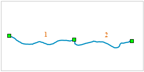

“自动连线”功能可以实现将某一段线对象（A）捕捉到另一段线对象（B）上，并在捕捉位置上，将这两个线对象按照绘制顺序自动连接成一个线对象。此功能在对线对象进矢量化时，可以将多次绘制的线对象在节点捕捉的位置进行连接，得到一个新的线对象，可以提高用户矢量化的速度。连接的线对象可以是不同类型线对象，比如折线、弧段、矩形等。

如下图所示为一段河流的示意图，通过自动连接功能可以按照图中数字所示，在绘制过程中，将这些单个线对象在端点捕捉处（绿色方块处）连接为一个新的对象。

  
---  

### 使用说明

* 自动连接线对象功能适用于线图层、CAD 图层。
* 只有当前地图窗口中有可编辑的线图层时，“自动连接线”复选框才可用。
* 自动连接线对象不仅适用于简单对象，同时适用于复合对象。

### 操作步骤

1. 将地图窗口中要进行启用自动连接线对象功能的图层设置为可编辑状态。
2. 在“ **对象操作** ”选项卡的“ **对象绘制** ”组中，单击“ **绘制设置** ”下拉按钮，在下拉菜单中选中“ **自动连接线** ”选项，启用自动连接线对象的功能；或通过 “Shift+J” 快捷键方式，启用自动连接线对象的功能。若想取消自动连接线对象功能，再次单击该选项即可。
3. 在地图窗口的任意位置绘制一个线对象，可以是任何类型的线对象，例如折线。
4. 启用捕捉功能，捕捉下一段线对象要开始绘制的位置，开始绘制新的线对象。新绘制的线对象可以是任何类型的线对象，例如多折线。关于捕捉功能的说明，请参见[开启图层捕捉](../Snapping/DTv2_Snappable.html)。
5. 点击鼠标右键，结束绘制。此时新绘制的线对象与第一次绘制的线对象自动连接为一个对象。此对象的属性与第一个对象的属性保持一致。
6. 如需连接更多的线对象，重复第4和5步即可。

### 备注

* 自动连接的线对象可以是任何类型的线对象，折线，自由曲线、椭圆等等。
* 只能对线段端点处进行连接，若开始绘制的起点位置在源线对象的非端点的其他节点处，则不会自动将源对象与当前绘制对象进行连接。
