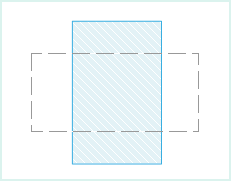
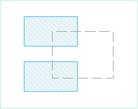
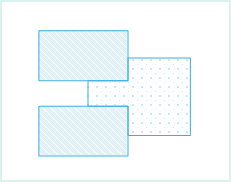
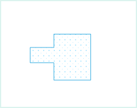

### 使用说明

“自动切割面”功能用来在绘制面对象时，将当前绘制的面对象与其他面对象相交的部分自动切割除去，并得到新的对象。得到新对象可能是单个对象，也有可能是复杂面对象。

* 自动切割面对象功能适用于面图层或者 CAD 图层。
* 如果绘制的新对象，与图层中的其它对象相交，则会自动切割新绘制的对象，相交的部分会切割除去，得到一个新对象。
* 如果绘制的新对象没有与任何对象相交，则不会自动切割面对象，即保留绘制的对象。
* 如果绘制的新对象穿过原有的面对象，则生成一个复杂面对象，即具有多个子对象的面对象。如下图所示，新绘制的面对象（虚线矩形）穿越另外一个面对象（填充矩形），得到的结果为包含2个子对象的复杂对象。
 
 
  
### 操作步骤

1. 在**对象操作**选项卡的“ **对象绘制** ”组中，单击“ **绘制设置** ”下拉按钮，在下拉菜单中选中“ **自动切割面** ”选项；或通过 “Shift+R” 快捷键方式，启用自动切割面对象的功能。若想取消自动切割面对象功能，再次单击该选项即可。   
2. 在当前可编辑图层中，绘制一个面对象。如下图所示，绘制一个矩形对象（用虚线表示）。
  
    

3. 绘制的矩形与该图层中的其它两个矩形相交，则绘制的矩形（虚线矩形）会被其它两个矩形切割，得到一个新对象，如下图所示。
  
    
  
4. 移动得到的新对象，如下图所示。
  
      

5. 如想取消自动切割面对象功能，取消勾选“自动切割面”即可。

