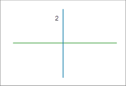

### 使用说明

“自动打断线”功能用来在绘制线对象时，会在相交位置将原对象和新绘制的线对象自动打断，并同时生成多个线对象。

* 自动打断线对象适用于线图层或者 CAD 图层。
* 自动打断线的操作过程如下图所示。 

绘制与图1中相交的线对象，在启用自动打断线对象和不使用自动打断线对象的对比结果，如图2和图3所示。

 |  |   
---|---|---  
图1 绘制线对象 | 图2 非自动打断 | 图3 自动打断结果  

原线对象（图1中的线1）被打断后即被删除，而由其生成的新线对象（图3中的线3和线4）的系统字段（除 SmUserID外）由系统赋值，非系统字段和字段
SmUserID 保留原线对象的相应属性。新绘制生成的线对象（图3中的5和6）的属性信息则按绘制的顺序添加到其属性表。

* 如果绘制的线对象与一个复杂线对象（原对象）相交，即有多个子对象的线对象，则在启用自动打断线对象状态下，新绘制的线对象会在相交处被打断，原对象仍为复杂对象，但会在相交处产生新的子对象。可以选中该对象，单击右键，在属性对话框中查看。
* 如果绘制的新对象没有与任何线对象相交，则在启用自动打断线对象时，也不会自动打断线对象，只保留绘制的对象。

### 操作步骤

1. 在“ **对象操作** ”选项卡的“ **对象绘制** ”组中，单击“ **绘制设置** ”下拉按钮，在下拉菜单中选中“ **自动打断线** ”选项；或通过 “Shift+K” 快捷键方式，启用自动打断线对象的功能。若想取消自动打断线对象功能，再次单击该选项即可。
2. 在当前可编辑图层中，绘制一个线对象。绘制完成后，绘制的新对象和原对象在相交处被自动打断为多个对象。

