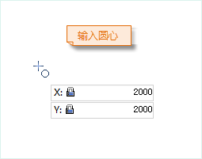
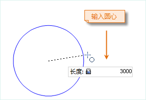
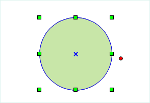

### 使用说明

可以使用多种方法创建圆。可以通过指定圆心、半径、直径、圆周上的点等方式实现。应用程序提供了5种绘制圆的方式。默认绘制方式是指定圆心和半径。

### 操作步骤

**通过圆心和半径绘制圆**

1. 在“ **对象操作** ”选项卡的“ **对象绘制** ”组中，单击“ **面** ”下拉按钮，选择下拉菜单中的“ **圆心、半径** ”按钮，出现圆心圆光标。
2. 将鼠标移动到地图窗口中，可以看到随着鼠标的移动，其后的参数输入框中会实时显示当前鼠标位置的坐标值。在该参数输入框中输入圆心点的坐标值（可以通过按 Tab 键，在两个参数输入框间切换）后按 Enter 键，确定圆心。
3. 再次移动鼠标并在其后的参数输入框中输入半径（长度），按 Enter 键，完成绘制。  

 |  |   
---|---|---  

**通过直径绘制圆**

1. 在“ **对象操作** ”选项卡的“ **对象绘制** ”组中，单击“ **面** ”下拉按钮，选择“ **起点、直径** ”选项，此时出现圆光标。
2. 将鼠标移动到地图窗口中，可以看到随着鼠标的移动，其后的参数输入框中会实时显示该点的坐标值。在该参数输入框中输入直径起点的坐标值（可以通过按 Tab 键，在两个参数输入框间切换）后按 Enter 键，确定直径起点。
3. 移动鼠标，可以看到随着鼠标的移动，地图窗口中会实时标识鼠标位置与直径起点连线的长度及其与 X 轴正向之间的夹角（可以通过按 Tab 键，在两个参数输入框间切换），在参数输入框中输入长度和角度值。
4. 确定直径后，按 Enter 键完成圆的绘制。

**通过圆周上两点绘制圆**

1. 在“ **对象操作** ”选项卡的“ **对象绘制** ”组中，单击“ **面** ”下拉按钮，选择“ **两点** ”选项，此时出现圆光标。
2. 将鼠标移动到地图窗口中，可以看到随着鼠标的移动，其后的参数输入框中会实时显示当前鼠标位置的坐标值。在该参数输入框中输入圆周上一点的坐标值（可以通过按 Tab 键，在两个参数输入框间切换）后按 Enter 键，确定圆上一点。
3. 移动鼠标，随着鼠标的移动，在其后的参数输入框中输入圆周上另外一点的坐标值（可以通过按 Tab 键，在两个参数输入框间切换）。
4. 按 Enter 键后，会以圆周上这两点之间的距离作为直径，绘制圆对象。

**通过圆周上三点绘制圆**

1. 在“ **对象操作** ”选项卡的“ **对象绘制** ”组中，单击“ **面** ”下拉按钮，选择“ **三点** ”选项，此时出现三点圆光标。
2. 将鼠标移动到地图窗口中，可以看到随着鼠标的移动，其后的参数输入框中会实时显示该点的坐标值。在该参数输入框中输入圆周上第一点的坐标值（可以通过按 Tab 键，在两个参数输入框间切换）后按 Enter 键，确认圆上第一个点的坐标。
3. 移动鼠标，在其后的参数输入框中输入圆周上第二点的坐标值（可以通过按 Tab 键，在两个参数输入框间切换）后按 Enter 键，确认圆上第二个点的坐标。
4. 移动鼠标，在其后的参数输入框输入圆周上第三点的坐标值（可以通过按 Tab 键，在两个参数输入框间切换）后按 Enter 键，绘制经过这三点的圆。

**绘制矩形的外接圆**

1. 在“ **对象操作** ”选项卡的“ **对象绘制** ”组中，单击“ **面** ”下拉按钮，选择“ **矩形外接圆** ”选项，此时出现矩形外接圆光标。
2. 将鼠标移动到地图窗口中，可以看到随着鼠标的移动，其后的参数输入框中会实时显示该点的坐标值。在该参数输入框中输入矩形起点的坐标值（可以通过按 Tab 键，在两个参数输入框间切换）后按 Enter 键，确认矩形起点位置。
3. 移动鼠标，随着鼠标的移动，参数输入框会实时显示矩形的高度和宽度（可以通过按 Tab 键，在两个参数输入框间切换），在参数输入框中键入矩形的宽度和高度。
4. 按 Enter 键后，会创建上一步骤中确定的矩形的外接圆。

### 注意事项

在线数据集中绘制的圆均为普通线对象，只记录线上各个节点的坐标，但是在 CAD 数据集中绘制的圆对象为参数化对象，会记录相应的参数，如半径和圆心等。

