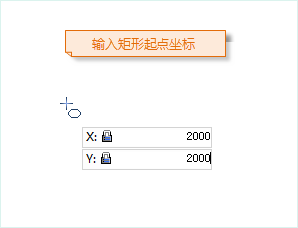
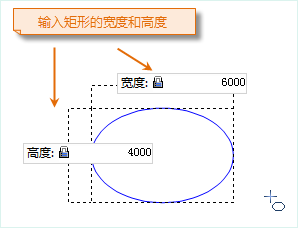
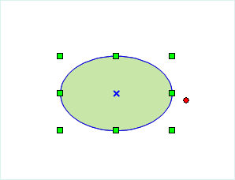

### 使用说明

“椭圆”命令用来创建一个椭圆对象。应用程序提供了两种方式绘制椭圆对象，一种是绘制矩形的内切椭圆，一种是通过长半轴和短半轴绘制斜椭圆。

### 操作步骤

**绘制矩形内切的椭圆**

1. 在“ **对象操作** ”选项卡的“ **对象绘制** ”组中，单击“ **面** ”下拉按钮，选择“矩形内切椭圆”选项，出现椭圆光标。
2. 将鼠标移动到地图窗口中，可以看到随着鼠标的移动，其后的参数输入框中会实时显示该点的坐标值。在参数输入框中输入椭圆的起始点坐标（可以通过按 Tab 键，在两个参数输入框间切换）后按 Enter 键，确定椭圆的起始位置。
3. 移动鼠标，可以看到蓝色的临时椭圆随着鼠标的移动大小发生变化。并且随着鼠标的移动，会实时地显示矩形的宽度和高度，在其后的参数输入框中输入参数值，按 Enter 键执行输入，确定椭圆的位置。 

注意：此时如按住 Shift 键，将得到矩形宽度和高度相等的正圆。

4. 单击鼠标右键取消当前绘制操作。  

 |  |   
---|---|---  

**绘制斜椭圆**

1. 在“ **对象操作** ”选项卡的“ **对象绘制**** ”组中，单击“ **面** ”下拉按钮，选择“斜椭圆”选项，此时出现椭圆光标。
2. 将鼠标移动到地图窗口中，可以看到随着鼠标的移动，其后的参数输入框中会实时显示该点的坐标值。在参数输入框中输入斜椭圆一个半轴（长半轴或者短半轴）的起始点坐标（可以通过按 Tab 键，在两个参数输入框间切换）后按 Enter 键，确定斜椭圆半轴的起始位置。
3. 移动鼠标，地图窗口中会实时标识鼠标位置与半轴起点连线的长度及其与 X 轴正向之间的夹角（可以通过按 Tab 键，在两个参数输入框间切换），在参数输入框中输入长度和角度值，按 Enter 键执行输入，完成斜椭圆一个半轴的绘制。
4. 继续移动鼠标，地图窗口中会实时显示斜椭圆另外一个半轴与半轴起点（上一步骤中确定的半轴起点）连线的长度，在参数输入框中键入该半轴的长度，按 Enter 键，完成斜椭圆的绘制。
5. 单击鼠标右键取消当前绘制操作。

### 注意事项

在线数据集中绘制的椭圆均为普通线对象，只记录线上各个节点的坐标，但是在 CAD
数据集中绘制的椭圆对象为参数化对象，会记录相应的参数，如圆心、长半轴和短半轴等。

