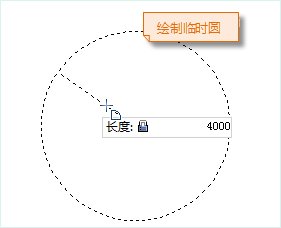
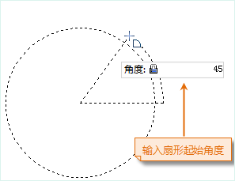
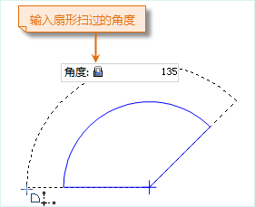
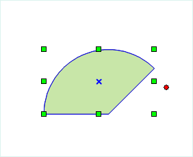

### 使用说明

  * “扇形”命令用来绘制一个扇形对象。应用程序提供两种绘制扇形的方式，一种是通过绘制圆来得到正圆扇形，一种是通过绘制椭圆得到椭圆扇形。
  * 绘制的扇形对象是（椭）圆对象的一部分，所以在绘制扇形对象之前，需要首先绘制一个（椭）圆对象。

### 操作步骤

**正圆扇形**

  1. 在“ **对象操作** ”选项卡的“ **对象绘制** ”组单击“ **面** ”下拉按钮，选择“ **正圆扇形** ”命令，出现正圆扇形光标。
  2. 将鼠标移动到地图窗口中，在其后的参数输入框中输入圆心的坐标值（可以通过按 Tab 键，在两个参数输入框间切换）后按 Enter 键，确定圆心位置。
  3. 再次移动鼠标并在其后的参数输入框中输入半径（长度），按 Enter 键，完成圆的绘制。
  4. 继续移动鼠标，在参数输入框中输入扇形的的起始角度，按 Enter 键确认。
  5. 移动鼠标，在参数输入框中输入扇形扫过的角度，按 Enter 键，完成正圆扇形的绘制。
  6. 单击鼠标右键取消当前绘制操作。  

  
   
  
  

**椭圆扇形**

  1. 在“ **对象操作** ”选项卡的“ **对象绘制** ”组单击“ **扇形** ”下拉按钮，选择“ **椭圆扇形** ”命令， 出现扇形光标。
  2. 将鼠标移动到地图窗口中，可以看到随着鼠标的移动，其后的参数输入框中会实时显示当前鼠标位置的坐标值。在参数输入框中输入椭圆的起始点坐标（可以通过按 Tab 键，在两个参数输入框间切换）后按 Enter 键，确定椭圆的起始位置。
  3. 移动鼠标，地图窗口中会实时标识鼠标位置与半轴起点连线的长度及其与 X 轴正向之间的夹角（可以通过按 Tab 键，在两个参数输入框间切换），在参数输入框中输入长度和角度值，按 Enter 键执行输入，完成斜椭圆一个半轴的绘制。
  4. 继续移动鼠标，在参数输入框中输入椭圆另外一个半轴的长度，按 Enter 键，完成斜椭圆的绘制。 
  5. 继续移动鼠标，在参数输入框中输入扇形的的起始角度，按 Enter 键确认。
  6. 移动鼠标，在参数输入框中输入扇形扫过的角度，按 Enter 键，完成椭圆扇形的绘制。
  7. 单击鼠标右键取消当前绘制操作。

### 注意事项

在线数据集中绘制的扇形均为普通线对象，只记录线上各个节点的坐标，但是在 CAD
数据集中绘制的扇形对象为参数化对象，会记录相应的参数，如圆心、长半轴、短半轴、起始角度和扫描角度等。

