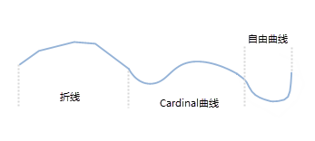

### 使用说明

“绘制多段线”命令用来绘制一条有多种类型线段组成的连续线对象。通过该功能绘制的线对象可由折线、Cardinal曲线、自由曲线组成，绘制过程中可切换线段类型为这三种中的任意一种。线对象主要用来描述线状地物，如河流、铁路、道路、电力线等。

### 操作步骤

  1. 在“ **对象操作** ”选项卡的“ **对象绘制** ”组中，单击“ **绘制设置** ”下拉按钮，选择” **绘制多段线** “选项，将绘制状态切换为支持多段线。
  2. 此时，鼠标为绘制折线状态，可在“对象绘制”组中，单击“曲线”下拉按钮，选择Cardinal曲线、自由曲线，切换多段线的绘制类型。
  3. 将鼠标移动到地图窗口中，在适当的位置单击鼠标左键，确定多段线的起始位置，继续移动鼠标到合适的位置，依次单击鼠标左键，确定多段线的节点。
  4. 绘制一个多段线对象过程中，可在“对象绘制”组中切换多段线类型，切换线段类型后将鼠标移至地图窗口中继续绘制即可，单击鼠标右键结束当前绘制操作。
  

多段线  

###  注意事项

绘制多段线操作不支持参数化绘制。

###  相关主题

 [绘制折线](DrawPolyLine.htm)

 [绘制曲线](DrawCurve.htm)

