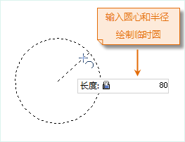
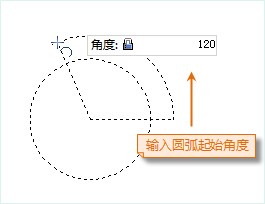
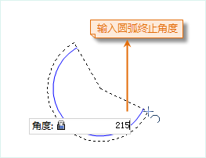
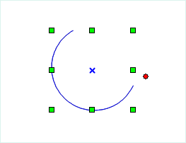

### 使用说明

绘制圆弧，可以通过圆心、端点、起点、半径、角度等参数确定。可以使用多种方法创建圆弧（或者椭圆弧）。应用程序提供了三种常用的绘制圆弧的方式，正圆弧、三点弧和椭圆弧。

绘制的圆弧对象是（椭）圆对象的一部分，所以在绘制圆弧对象之前，需要首先绘制一个（椭）圆对象。

### 操作步骤

**通过指定三点绘制圆弧（三点弧）**

1. 在当前图层可编辑的情况下，在“ **对象操作** ”选项卡的“ **对象绘制** ”组中，单击“ **线** ”下拉按钮，选择“ **三点弧** ”选项，出现三点弧光标。
2. 将鼠标移动到地图窗口中，可以看到在地图窗口中随着鼠标的移动，其后的参数框中会实时显示当前的坐标值。在该参数设置框中输入三点弧上的一个点的坐标值（可以通过按 Tab 键，在两个参数输入框间切换）后按 Enter 键，确定三点弧的起始位置。
3. 再次移动鼠标，在参数输入框中输入第二点的坐标，按 Enter 键进行确认。
4. 继续移动鼠标，在参数输入框中输入最后一个点的坐标值，按 Enter 键，完成三点弧的绘制。
5. 单击鼠标右键可取消当前绘制操作。

**通过指定起点、圆心、角度绘制圆弧（正圆弧）**

1. 在“ **对象操作** ”选项卡的“ **对象绘制** ”组中，单击“ **线** ”下拉按钮，选择“ **正圆弧** ”选项，出现正圆弧光标。
2. 将鼠标移动到地图窗口中，可以看到随着鼠标的移动，其后的参数输入框会实时显示该点的坐标值。在该参数输入框中输入起点的坐标值（可以通过按 Tab 键，在两个参数输入框间切换）后，按 Enter 键，确定圆心。 
3. 再次移动鼠标并在其后的参数输入框中输入圆的半径（长度），按 Enter 键，绘制一个圆。
4. 以绘制完成的圆为参考，移动鼠标，在其后的参数输入框中输入起始角度（起始角度为 X 轴正方向与圆弧起始半径逆时针方向的夹角），确定圆弧的起始位置。
5. 确定了圆弧的起始角度后，继续移动鼠标，在其后的参数输入框中输入圆弧扫过的角度，按 Enter 键，绘制一段圆弧。  

 |  |  |   
---|---|---|---  

**绘制椭圆弧**

1. 在当前图层可编辑的情况下，在“ **对象操作** ”选项卡的“ **对象绘制** ”组中，单击“ **线** ”下拉按钮，选择“ **椭圆弧** ”命令，出现椭圆弧光标。
2. 移动鼠标，在参数输入框中输入斜椭圆一个半轴（长半轴或者短半轴）的起始点坐标（可以通过按 Tab 键，在两个参数输入框间切换）后按 Enter 键，确定斜椭圆半轴的起始位置。 
3. 移动鼠标，地图窗口中会实时标识鼠标位置与半轴起点连线的长度及其与 X 轴正向之间的夹角，在参数输入框中输入长度和角度值（可以通过按 Tab 键，在两个参数输入框间切换），按 Enter 键执行输入，完成斜椭圆一个半轴的绘制。
4. 继续移动鼠标，在参数输入框中键入另外一个半轴的长度，按 Enter 键，完成斜椭圆的绘制。
5. 移动鼠标，在其后的参数输入框中输入起始角度（起始角度为 X 轴正方向与圆弧起始半径逆时针方向的夹角），确定椭圆弧的起始位置。
6. 继续移动鼠标，在其后的参数输入框中输入椭圆弧扫过的角度，按 Enter 键，绘制一段椭圆弧。

### 注意事项

在线数据集中绘制的圆弧均为普通线对象，只记录线上各个节点的坐标，但是在 CAD 数据集中绘制的圆弧对象为参数化对象，会记录相应的参数，如半径和圆心等。

