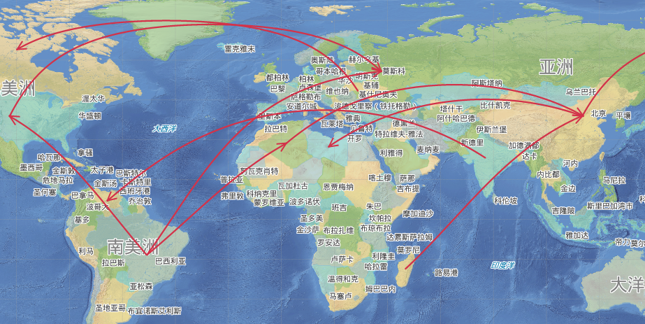

### 使用说明

应用程序支持多种曲线，贝兹曲线、B 样条曲线、Cardinal 曲线、自由曲线、测地线。

### 操作步骤

**绘制贝兹曲线**

贝兹曲线由不在曲线上的两个起始结点和两个终止结点控制曲线的走向，通过在曲线上的其他控制点拟合出曲线的各中间点。至少需要6个控制点才能完成一段贝兹曲线的绘制。

1. 在“ **对象操作** ”选项卡的“ **对象绘制** ”组中，单击“ **线** ”下拉按钮，选择“ **贝兹曲线** ”选项，出现贝兹曲线光标。
2. 将鼠标移动到地图窗口中，可以看到随着鼠标的移动，其后的参数输入框中会实时显示当前鼠标位置的坐标值。在参数输入框中输入贝兹曲线第一个控制点的坐标值（可以通过按 Tab 键，在两个参数输入框间切换）后按 Enter 键确认。
3. 同样的方式输入第二到第四个控制点的坐标，前面四个控制点的坐标确定了贝兹曲线的走向。
4. 输入曲线上第五个控制点的坐标，此时在第三个控制点和第四个控制点之间会出现蓝色虚线，是贝兹曲线上拟合的第一段线。
5. 继续输入第六个控制点的坐标，绘制贝兹曲线上第二段线。
6. 重新上一步骤，继续绘制贝兹曲线的其他线。
7. 单击鼠标右键，结束当前绘制。

**B 样条曲线**

B 样条曲线时通过曲线上首尾两个控制点，以及不在曲线上的各中间控制点绘制而成。曲线上的其它点都根据曲线上的中间控制点拟合得到。至少需要4个控制点才能完成一段
B 样条曲线的绘制。

1. 在“ **对象操作** ”选项卡的“ **对象绘制** ”组中，单击“ **线** ”下拉按钮，选择“ **B 样条曲线** ”选项，出现 B 样条曲线光标。
2. 将鼠标移动到地图窗口中，可以看到随着鼠标的移动，其后的参数输入框中会实时显示当前鼠标位置的坐标值。在参数输入框中输入曲线第一个控制点的坐标值（可以通过按 Tab 键，在两个参数输入框间切换）后按 Enter 键确认。
3. 输入曲线上第二个控制点的坐标。
4. 输入曲线上第三个控制点的坐标，此时在第二个控制点和第三个控制点之间会出现蓝色虚线，表示 B 样条曲线的第一段线。
5. 输入曲线上第四个控制点的坐标，此时在第三个控制点和第四个控制点之间出现蓝色虚线，表示 B 样条曲线的第二段线。
6. 重新上一步骤，继续绘制 B 样条曲线的其他段线。
7. 单击鼠标右键，结束当前绘制。

**Cardinal 曲线**

Cardinal 曲线是通过确定曲线上的各控制点绘制曲线，曲线的其它点是根据所有控制点拟合而成。至少需要3个控制点才能完成一段 Cardinal
曲线的绘制。

1. 在“ **对象操作** ”选项卡的“ **对象绘制** ”组中，单击“ **线** ”下拉按钮，选择“ **Cardinal 曲线** ”选项，出现 Cardinal 曲线光标。
2. 将鼠标移动到地图窗口中，可以看到随着鼠标的移动，其后的参数输入框中会实时显示当前鼠标位置的坐标值。在参数输入框中输入曲线第一个控制点的坐标值（可以通过按 Tab 键，在两个参数输入框间切换）后按 Enter 键确认。
3. 同样方式输入第二个控制点，可以看到这两点间出现一条蓝色虚线。
4. 移动鼠标，输入第三个控制点的坐标，可以看到从第二个控制点和第三个控制点之间会出现第二段蓝色虚线。
5. 单击鼠标右键，结束当前绘制。

**自由曲线**

自由曲线通过自由拖动鼠标绘制得到的一段曲线。绘制自由曲线在创建不规则边界或使用数字化仪追踪时非常有用。

1. 在“ **对象操作** ”选项卡的“ **对象绘制** ”组单击“ **线** ”下拉按钮，选择“ **自由曲线** ”选项，出现自由曲线光标。
2. 将光标移至创建自由曲线的位置，单击鼠标左键，并按住鼠标左键不放，移动鼠标，可以在地图上画出与光标移动轨迹一致的曲线。
3. 完成绘制后，单击鼠标右键结束操作。

**测地线**

测地线是指依地球表面弧度的曲线，可以最准确地表示地球表面任意两点之间的最短距离。常应用于绘制全球航海或航空的航线，需要开启[全球连贯漫游](../../../Visualization/BrowseMap/Pan.html#3)才可进行测地线绘制操作。

下面以绘制航空航线为例，详细说明该功能的操作步骤：

1. 打开示范数据中 World.smwu 工作空间，在地图窗口中打开“世界地图_Day”，并将航线数据集添加到地图中，开启线数据的可编辑。
2. 在“对象操作”选项卡的“对象绘制”组中，单击“线”下拉按钮，选择“测地线”选项，讲鼠标移至地图中即可开始绘制。
3. 在航线的起点和终点单击鼠标左边，绘制完成后单击鼠标右键即可结束当前绘制的线对象。绘制完后设置图层风格即可得到以下的结果图：
  
---  
图：航线图  
