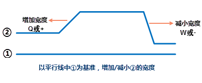
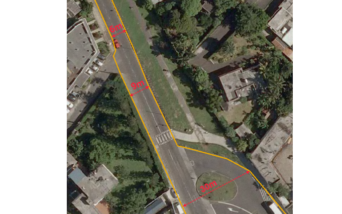

“平行线”命令用来绘制有两个子对象的平行线。在实际的应用中，平行线主要用来描述比较规则两条平行线状地物，如铁路、道路、电力线等。应用程序提供了“
**通过输入坐标值**”和“ **通过输入长度和角度**”两种绘制平行线的方式。

同时支持“ **绘制多平行线**”功能，通过指定待绘制平行线数目、各平行线的宽度等，满足不同应用场景下绘制平行线的需求。

支持在绘制平行线的过程中按照设置步长随时增加或减小平行线之间的宽度，方便用户绘制一条连续的不同宽度的平行线。

###  绘制平行线

**通过输入坐标值绘制平行线**

1. 在“ **对象操作** ”选项卡的“ **对象绘制** ”组中，单击“ **线** ”下拉按钮，选择“ **平行线** ”命令，出现平行线光标。同时弹出“ **设置步长** ”对话框。
2. **设置起点位置** ：将鼠标移动到地图窗口中，可以看到随着鼠标的移动，其后的参数输入框中会实时显示当前鼠标位置的坐标值。在该框中输入平行线起点的坐标值（可以通过按 Tab 键，在两个输入框间切换）后按 Enter 键，确定平行线的起始位置。
3. **设置平行线宽度** ：移动鼠标并在其后的参数输入框中输入平行线的宽度（长度），按 Enter 键执行输入。移动鼠标，可以看到平行线的宽度已经确定。  

   

4. 在地图窗口中会实时标识鼠标位置的点坐标 X、Y 坐标和宽度值（可以通过按 Tab 键，在三个参数输入框间切换）按 Enter 键，完成平行线下一个节点的坐标值。
5. 支持通过 Q 或 + 键增加平行线宽度；W 或 - 键减少平行线宽度。平行线是由两个线对象组成，如下图1以①线为基准，增加或减小的是②线与①线之间的宽度。支持在“设置步长”对话框中，对步长增长的方式和长度进行设置：  

  
---  
* **按百分比增长** ：默认为20%，即每增加和减少一次步长的比例是当前宽度的20%，例如当前宽度为100米，通过 Q 键增加一次，当前宽度变为120；当再增加一次，是在宽度120的基础上再增加20%，宽度即为144（120*20%）。以此类推，始终以当前宽度的百分比增长。
* **按固定长度增长** ：设置固定长度作为增长步长，默认为2米，即每增加或减少一次步长为2米。例如当前宽度为100米，通过 W 键减少一次，当前宽度变为98 米。始终以输入的固定值增大或减小宽度值。
6. 重复步骤4-6，完成平行线其它线段的绘制。用户可通过快捷键 Ctrl+R 改变平行线的绘制方向，程序会自动定位平行线的另外一个端点位置，以便用户随时切换绘制方向。 

**注意**
：当以固定的宽度连续绘制时，平行线保持平行。当连续增加或减小道路宽度时，平行线将不再保持平行。如矢量化下图所示的道路，该道路初始宽度为6m,中间宽度为9m,最后一段为宽度不均匀的路口位置。在绘制过程中，绘制6m至9m
段的道路为规则的固定宽度，可保持平行。当9m至30m 段，宽度持续增加为非连续，因此绘制出的双线为非平行线。  
  

7. 单击鼠标右键结束绘制平行线的操作。

**通过输入长度和角度绘制平行线**

1. 在“ **对象操作** ”选项卡的“ **对象绘制** ”组中，单击“ **线** ”下拉按钮，选择“ **平行线（长度、角度）** ”命令，出现平行线光标。同时弹出“ **设置步长** ”对话框。
2. 在地图窗口中 **设置起点位置、设置平行线宽度**，操作同" **通过输入坐标值绘制平行线** "的步骤2-3。
3. 确定起点和宽度后，地图窗口中会实时标识鼠标位置与起点连线的长度及其与 X 轴正方向之间的夹角和宽度值。在参数输入框中输入长度和角度值（可以通过按 Tab 键，在两个参数输入框间切换），按 Enter 键确认后即可确定平行线的长度。
4. 同时支持 **设置步长** , 其设置方式同“ **通过输入坐标值绘制平行线** "。
5. 重复步骤3，完成平行线其它线段的绘制。单击鼠标右键结束绘制平行线的操作。  

  

###  绘制多平行线

“绘制多平行线”，即用户可指定同时绘制平行线的数目，并分别对每条平行线的宽度进行设置。例如当对影像矢量化的过程中通常会遇到道路、沟渠、林地等带状用地同时分布排列，这时可使用“多平行线”功能，同时绘制道路、沟渠和林地3条平行线。一次性绘制多条平行线，为用户节约了绘图时间，极大的提升了工作效率。以下对该实例进行详细操作描述：

1. 在“ **对象操作** ”选项卡的“ **对象绘制** ”组中，单击“ **线** ”下拉按钮，选择“ **多平行线** ”命令，弹出“ **参数设置** ”对话框,设置待绘制平行线数目。
2. 单击“ **确定** ”按钮，弹出“ **设置步长** ”对话框，同时地图窗口中鼠标指针切换为绘制平行线状态，设置平行线起点位置。
3. 通过 Ctrl+Q 或 Ctrl+W 切换平行线，依次设置每条平行线的宽度。当平行线为红色填充区域，则表示当前平行线宽度可调整。
  
---  
多平行线设置  
4. 在地图窗口中会实时标识鼠标位置的点坐标 X、Y 坐标和宽度值（可以通过按 Tab 键，在三个参数输入框间切换）按 Enter 键，完成平行线下一个节点的坐标值。同时支持通过 Q 或 + 键增加平行线宽度；W 或 - 键减少平行线宽度。
5. 重复步骤3-4，完成平行线其它线段的绘制。绘制过程同“绘制平行线”。同时可通过快捷键 Ctrl+R 改变平行线的绘制方向。 
6. 单击鼠标右键结束绘制平行线的操作。
  

### 注意事项

* 当在绘制平行线的过程中，在“设置步长”对话框中调整了步长，再回到地图窗口继续绘制时，快捷键增大或减小宽度平行线会没有响应，这时只需移动一下地图，将窗口焦点重新回到平行线绘制窗口，即可解决上述问题。

**绘制平行线的快捷键**

快捷键 | 功能描述  
---|---  
W、- | 减小步长  
Q、+ | 增加步长  
Ctrl+R | 平行线反向  
Ctrl+Z | 回退一步操作  
Ctrl+P | 调出设置步长对话框  
Ctrl+E | 显示当前可调整宽度的平行线  

